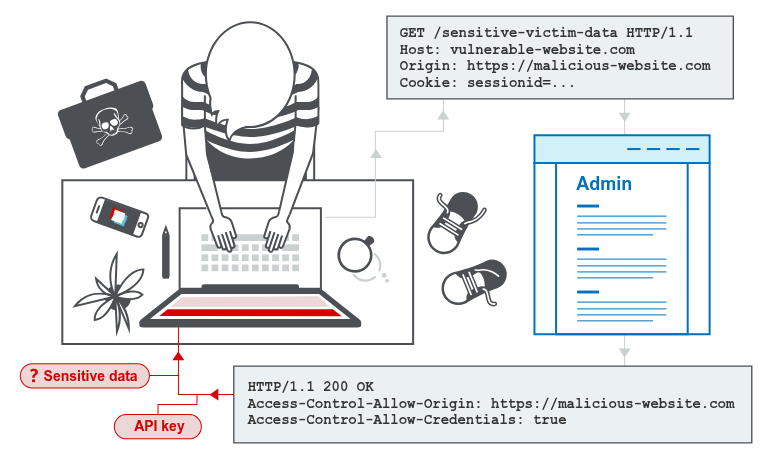

Let me explain **CORS** like you're completely new to the topic.

---

## First, let's understand the problem CORS solves

Imagine the internet is a giant apartment building.  
Each website (like `gmail.com` or `facebook.com`) is a separate **apartment** with its own locked door.

The **Same-Origin Policy (SOP)** is a security rule that says:  
> "A script running in Apartment A cannot go into Apartment B and take things, unless Apartment B explicitly allows it."

This is good — it stops bad websites from stealing your data from your bank or email.

---

## But sometimes apartments *want* to share

What if `myblog.com` wants to show your Twitter feed?  
Or `weather.com` wants to get your location from `maps.google.com`?

The Same-Origin Policy blocks that by default.  
That's where **CORS** comes in.

---

## CORS is the "visitor pass" system

**CORS (Cross-Origin Resource Sharing)** is a way for a website to say:

> "I normally don't let strangers in, but I'll make an exception for these specific websites."

It works using special **headers** — think of them as notes pinned to the apartment door.

Example:  
`Access-Control-Allow-Origin: https://trusted-site.com`

That means: `trusted-site.com` is allowed to fetch data from me. Everyone else is still blocked.

---

## Simple analogy

- **Same-Origin Policy** = Your house key only opens your front door.
- **CORS** = You give a spare key to a trusted neighbor, but only for certain hours and certain rooms.

Without CORS, no cross-domain sharing at all.  
With CORS, websites can *opt in* to sharing safely.

---

## Important warning

If a website sets CORS too loosely — like:

`Access-Control-Allow-Origin: *` (allow EVERYONE)

…then **any** website can read its data. That's dangerous.  
A bad guy could make a fake site that fetches your private info from your bank if the bank's CORS is misconfigured.

---

## What CORS does NOT do

CORS **does not protect against CSRF** (cross-site request forgery).

- **CSRF** tricks your browser into *sending* a request (like "transfer $100") using your existing login cookie.  
- **CORS** controls whether a website can *read* the response.

Think of it like this:  
- CSRF is about *ordering* something from a store using your credit card that's already on file.  
- CORS is about whether the store *shows you the receipt* afterward.

You can still place the order (CSRF) even if CORS blocks you from reading the response.

---

## Plain English summary

| Term | What it means |
|------|----------------|
| Same-Origin Policy | Default rule: websites can't talk to each other without permission |
| CORS | A permission system that lets websites say "this other site can access me" |
| CORS headers | Notes like "Allow only `bank.com` to read my data" |
| Misconfigured CORS | Accidentally letting *any* website read your private data |
| CORS vs CSRF | CORS controls *reading* responses; CSRF tricks you into *sending* requests without reading |

So CORS is like a bouncer at a club:  
Normally, no one gets in without an invitation.  
CORS lets the club owner hand out a few VIP passes to trusted guests. But if they hand out passes to everyone, the club becomes unsafe.

