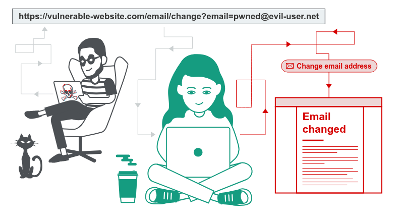

<h1 aligne='center'>What is CSRF?</h1> 

Imagine you’re logged into your online bank account.  
The bank’s website trusts you, so when you click a button to send money, it assumes it’s really you.  

Now, while you’re still logged into the bank, you go to a different website — maybe one a hacker made.  
That hacker’s website has a hidden button that secretly sends a request to your bank, saying “send $1000 to the hacker.”  

Because your browser still has your bank login info saved (like a cookie), the bank thinks *you* asked for the money.  
But you didn’t — the hacker tricked your browser into making the request.  

That trick is **CSRF** (Cross-Site Request Forgery).  
It’s like someone using your hand to sign a check without you knowing.

