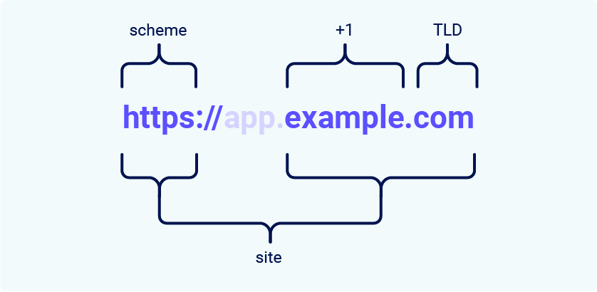

# What is a site in the context of SameSite cookies?

### The Mistake Beginners Make
Most people think `app.example.com` and `login.example.com` are **the same building** (same site). **They are not.**

In the eyes of the SameSite bouncer, they are **different apartments** in the same complex. The bouncer will let you walk between apartments, but he **will not transfer your VIP wristband** between them unless the owner specifically allows it.

### The Technical Definition: TLD+1 (The Building Name)
The browser defines a **"Site"** using this formula:

> **Scheme + eTLD+1**

Let's break that down with a real address: `https://app.example.com`

| Part of URL | Example Value | What it is in the Analogy | Does it change the "Site"? |
| :--- | :--- | :--- | :--- |
| **Scheme** | `https://` | **The Door Type** (Wood vs. Steel) | **YES** |
| **Subdomain** | `app` | **The Apartment Number** | **NO** |
| **Domain** | `example` | **The Building Name** | **YES** |
| **TLD** | `.com` | **The Street Name** | **YES** |

**The "Site" for SameSite purposes is ONLY:** `https` + `example` + `.com`

### Why `app.example.com` and `login.example.com` are Cross-Site
Here is the "Aha!" moment for someone with intermediate understanding.

You are logged into `app.example.com`. You have a VIP wristband for **Apartment A**.
You click a link to `login.example.com` (**Apartment B**).

**Question:** Will the bouncer at Apartment B accept the wristband from Apartment A?
**Answer:** **NO.** (Unless the wristband has `SameSite=None; Secure` written on it).

Even though both apartments are owned by `example.com`, the **bouncer sees them as different addresses**. This is **crucial for subdomain takeover attacks** (Trick #3 from our last chat). If a hacker takes over `old-app.example.com`, they **cannot** read your session from `app.example.com` because the bouncer stops the wristband transfer.

### The One Exception: The Backyard (Subdomain *Within* Same Site)
Wait. Earlier I said `app.example.com` is the *same site* as `example.com`?
**Yes.** Let's clarify the **TLD+1** math.

- **Same Site:** `https://app.example.com` **→** `https://example.com`
    - **Why?** The **TLD+1** is `.example.com` in both cases.
- **Different Site:** `https://app.example.com` **→** `https://another-example.com`
    - **Why?** The **TLD+1** is different (`.example.com` vs `.another-example.com`).

### The Tricky Part: The "e" in eTLD (The UK Problem)
You might see the term **eTLD** (effective Top-Level Domain).
This exists because of domains like `.co.uk`.

If you own `app.example.co.uk`:
- **WRONG MATH:** TLD = `.uk`, Domain = `.co` -> Site = `co.uk` (Too broad, matches everyone).
- **RIGHT MATH (eTLD):** The browser knows `.co.uk` is **one unit**.
- **Result:** The **Site** is `example.co.uk`.

### Summary Table for Someone Who Knows the Basics

| Request From | Request To | **Is it Same-Site?** | **Why?** |
| :--- | :--- | :--- | :--- |
| `https://app.example.com` | `https://example.com` | ✅ **YES** | Same Scheme & eTLD+1 |
| `http://app.example.com` | `https://app.example.com` | ❌ **NO** | **Scheme Mismatch** (HTTP vs HTTPS) |
| `https://app.example.com` | `https://login.example.com` | ✅ **YES** | Same eTLD+1 (both are `example.com`) |
| `https://example.com` | `https://evil.com` | ❌ **NO** | Different eTLD+1 |

**Correction on Subdomains:** *In the previous response, I stated `app` vs `login` was a bypass. That was incorrect for modern **Default Lax**.* Modern `SameSite` **DOES** allow cookies across subdomains of the same registrable domain (eTLD+1).
- `app.example.com` and `login.example.com` **are the same site** for the bouncer.
- The bypass only happens when the **eTLD+1** is different (e.g., `example.com` vs `attacker.com`).