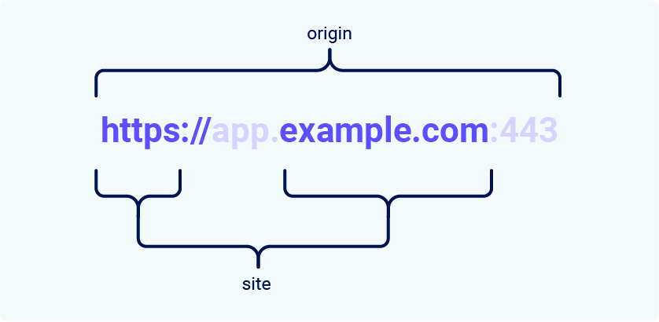

# What's the difference between a site and an origin?

Here is the simplest way to separate them mentally:

- **Origin:** The **EXACT Address** including the apartment number and what type of door it is.
- **Site:** The **Building Name** and what street it's on.

### The Critical Hierarchy: The Venn Diagram
This is the most important thing to remember for security testing:

> **A Cross-Origin request can STILL be Same-Site.**
> **A Cross-Site request is ALWAYS Cross-Origin.**

Think of it like this:
1.  **Same-Origin:** You are in the **same room**.
2.  **Same-Site (but Cross-Origin):** You are in a **different room in the same house**.
3.  **Cross-Site:** You are in a **different house entirely**.

### The Missing Piece: The Port Number
You understand Scheme (`https://`) and Domain (`example.com`). The thing that separates **Site** from **Origin** the most is the **Port Number**.

- **Site (SameSite Cookie Bouncer):** **IGNORES** the port number.
    - `https://example.com` = `https://example.com:8443` (Same Site)
- **Origin (CORS/JavaScript Bouncer):** **ENFORCES** the port number.
    - `https://example.com` ≠ `https://example.com:8443` (Different Origin)

### Why This Distinction Destroys Security (The Subdomain Takeaway)
The text you provided highlights a crucial security implication:
> *"...any vulnerability enabling arbitrary JavaScript execution can be abused to bypass site-based defenses on other domains belonging to the same site."*

Let's translate that using the table you provided.

**Scenario:**
You have a secure main app: `https://app.example.com`
You have an old, forgotten blog: `https://blog.example.com`

**The Table Says:** These are **Same-Site**. (✅ Yes).
**The Table Says:** These are **Cross-Origin**. (❌ No: mismatched domain name).

**The Attack:**
If a hacker finds an **XSS vulnerability** (arbitrary JavaScript execution) on `blog.example.com`...

1.  **Can they read the HTML of `app.example.com`?** **NO.** Because the **Origin** is different. The browser's *Same-Origin Policy* stops `blog` from reading `app`'s bank balance.
2.  **Can they send a POST request to `app.example.com/change-email`?** **YES.** Because the **Site** is the same. The browser's *SameSite Cookie* bouncer says, "Oh, you're both from `example.com`? Come on in, bring your wristband."

**The Bypass Explained:**
You are safe from **reading** data (Origin protects you). You are **NOT** safe from **sending** commands (Site allows the cookie). This is exactly how CSRF attacks survive in a SameSite Lax world if you have a vulnerable subdomain.

### The "Scheme Mismatch" Trap (HTTP vs HTTPS)
Look at the last row of your table:
`https://example.com` → `http://example.com` = **No** (Same-Site? No).

This is the **Downgrade Attack** prevention.
If a hacker tricks you into visiting the **insecure** `http://` version of the site, the browser says: *"This is a completely different Site."* It will **NOT** send your `https://` VIP wristband over the insecure connection.

### Summary for Your Understanding Level

| Feature | **Origin** | **Site** |
| :--- | :--- | :--- |
| **Includes Port?** | **Yes** (`:8080` matters) | **No** (ignores `:8080`) |
| **Includes Subdomain?** | **Yes** (`app.` vs `blog.` matters) | **No** (both just `example.com`) |
| **Security Context** | **Reading Data** (CORS) | **Sending Commands** (CSRF/Cookies) |
| **Analogy** | Specific Apartment Key | Building Access Badge |