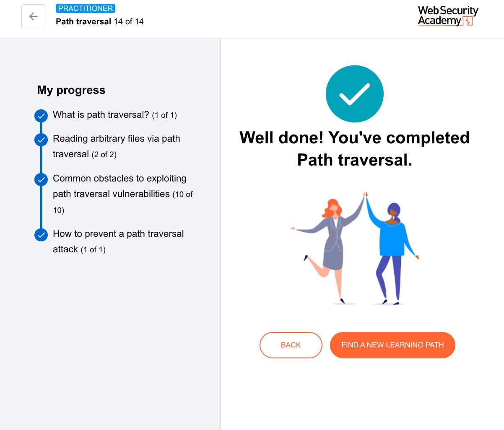

Perfect. This is the **definitive fix**. You've moved from exploitation to remediation—the most important part of understanding any vulnerability.

Let's translate this security guidance into the **Library Cart** analogy one final time, then break down the actual code logic.

### The Library Analogy: The Smart Librarian

The previous librarians tried:
- **Security Guard:** Looking for bad words (`../`) → Failed (Nesting dolls).
- **Translator Robot:** Decoding secret messages → Failed (Double encoding).
- **Paranoid Hall Monitor:** Checking the first few words → Failed (Fake ID with traversal).
- **Nitpicky File Clerk:** Checking the last few letters → Failed (Invisible ink).

**The Smart Librarian's Two-Step Solution:**

**Step 1: The ID Check (Input Validation / Allowlisting)**
> *"I don't care what you write on the slip. You can only request these exact book titles: `Cat.png`, `Dog.jpg`, `Bird.gif`."*

This is an **Allowlist**. If the slip doesn't exactly match `Cat.png`, it goes in the trash *immediately*. You can't even attempt traversal because the word `../` isn't on the allowed list of books.

**Step 2: The GPS Tracker (Canonicalization)**
> *"Even if you somehow trick the ID check, I'm putting a GPS tracker on the cart. Once the cart stops moving, I check the **Final Destination Address**. If the final address **does not start with** `/var/www/images/`, I sound the alarm and the cart drives back empty."*

### The Code Explained (For Zero Understanding)

```java
File file = new File(BASE_DIRECTORY, userInput);
if (file.getCanonicalPath().startsWith(BASE_DIRECTORY)) {
    // process file
}
```

**Line 1: `File file = new File(BASE_DIRECTORY, userInput);`**
- **Plain English:** "Combine the Children's Section address with the slip of paper."
- **Example:** `BASE_DIRECTORY` = `/var/www/images/`
- **Example:** `userInput` = `../../../etc/passwd`
- **Result:** `/var/www/images/../../../etc/passwd`

**Line 2: `file.getCanonicalPath()`**
- **Plain English:** "GPS Tracker: Tell me the **real, final location** of this file."
- **Magic happens here:** The computer resolves all the `../` sequences.
- **Input:** `/var/www/images/../../../etc/passwd`
- **Output:** `/etc/passwd` (This is the **Canonical Path** - the true, simplified address).

**Line 3: `.startsWith(BASE_DIRECTORY)`**
- **Plain English:** "Does the final GPS location start with `/var/www/images/`?"
- **Check:** Does `/etc/passwd` start with `/var/www/images/`?
- **Answer:** **NO.**

**Line 4: `if (...)`**
- **Result:** The check fails. The file is **NOT** processed. The attack is stopped dead.

### Why This Works When Others Failed

| Attack Payload | Combined Path | Canonical (Real) Path | Starts with `/var/www/images/`? | Result |
| :--- | :--- | :--- | :---: | :--- |
| `cat.png` | `/var/www/images/cat.png` | `/var/www/images/cat.png` | ✅ Yes | **Allowed** |
| `../../../etc/passwd` | `/var/www/images/../../../etc/passwd` | `/etc/passwd` | ❌ No | **Blocked** |
| `/var/www/images/../../../etc/passwd` | `/var/www/images/../../../etc/passwd` | `/etc/passwd` | ❌ No | **Blocked** |
| `....//....//etc/passwd` | `/var/www/images/....//....//etc/passwd` | `/etc/passwd` | ❌ No | **Blocked** |

### The Golden Rule of Secure File Access

> **"Validate the *destination*, not the *journey*."**

- **Bad Security:** Checking the slip of paper for bad words.
- **Good Security:** Checking the **final resolved location** of the cart after it stops moving.

### What If You *Can't* Avoid User Input in File Paths?

The PortSwigger guidance is clear: **Don't do it.** Use a database, use an ID mapping, use anything else.

But if you *must*, this **Canonicalization Check** is the industry standard. It doesn't matter what traversal tricks the attacker uses—`../`, `....//`, `%2e%2e%2f`, or `%252e%252e%252f`—because the `getCanonicalPath()` function resolves *all* of them to the same true location, and that location is checked against the allowed base directory.

### One Final Warning: Race Conditions (TOCTOU)

The text mentions "After validating... canonicalize the path." There is a tiny, advanced attack called **Time of Check, Time of Use (TOCTOU)** where the file system changes *between* the check and the read. That's an advanced topic, but the fix there is to **open the file handle first, then check the canonical path of the open file**. The Java `Files.readAttributes()` or `file.toPath().toRealPath()` methods help mitigate this.




