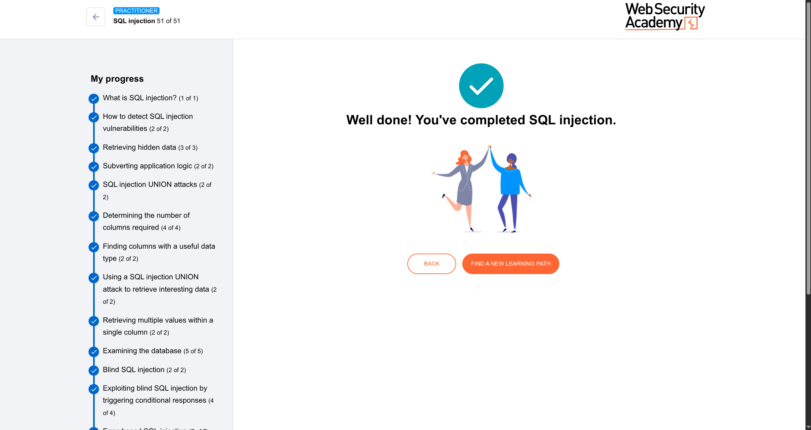

---

## Where parameterized queries work (most places)

Parameterized queries (the `?` placeholders) work perfectly when user input is **data** like:
- Search terms (`WHERE category = ?`)
- New values (`INSERT INTO books (title) VALUES (?)`)
- Update values (`SET price = ?`)

In these places, user input is treated **only as data** — safe.

---

## Where parameterized queries **don't work**

They **can't** be used for parts of the SQL query that are **structural** — things that define *how* the query runs, not *what data* it uses.

Examples:
- **Table names** — `SELECT * FROM ?` (doesn't work)
- **Column names** — `SELECT ? FROM books` (doesn't work)
- **ORDER BY column** — `ORDER BY ?` (doesn't work)
- **ASC / DESC** direction — `ORDER BY name ?` (doesn't work)

---

## Why can't they work there?

Because those parts need to be known **before** the database plans the query.  
Placeholders (`?`) are for values only. The database needs to know *which table* or *which column* to look at *before* it sees the value.

---

## Example to make it concrete

**What the user wants:** Choose which column to sort by.

Unsafe attempt (doesn't work):
```java
PreparedStatement stmt = connection.prepareStatement("SELECT * FROM products ORDER BY ?");
stmt.setString(1, userInput);  // This won't work as intended
```

The database will treat `userInput` as a *value*, not a column name.  
So if `userInput = "price"`, it will sort by the *string* `"price"` — nonsense.

---

## What to do instead

### 1. Whitelisting (most common)
Only allow specific, safe values:

```java
String[] allowedColumns = {"name", "price", "date"};
if (Arrays.asList(allowedColumns).contains(userInput)) {
    // Safe to use directly
    String query = "SELECT * FROM products ORDER BY " + userInput;
} else {
    // Default to something safe
    userInput = "name";
}
```

### 2. Change the logic
Instead of letting the user pick a column name, give them numbered options:

User says: `sort=1` → you map that to `ORDER BY name`  
User says: `sort=2` → you map that to `ORDER BY price`  

The user never touches the actual column name.

---

## Critical warning (don't be clever)

**Never** try to decide case-by-case:  
> "This data looks safe, I can use string concatenation here."

Why not?  
- You might be wrong about where the data came from  
- Data that was safe yesterday might become tainted tomorrow when someone changes other code  
- One mistake breaks everything

**The rule:**  
- Parameterized query if possible (data only)  
- Whitelisting if not possible (structure changes)  
- **Never string concatenation with user input** — even if you "think" it's safe today

