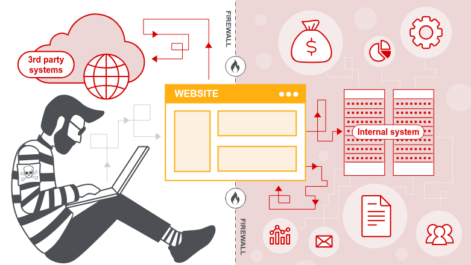

Let me explain **SSRF** like you’ve never heard of computers before.

---

Imagine you have a **personal assistant** (the server).  
You tell your assistant: *“Go to the store and buy whatever is on this shopping list I give you.”*

Normally, you give the assistant a list with things like:  
- Milk  
- Bread  
- Eggs  

The assistant goes to the **real store** (the internet) and gets them. That’s normal.

---

**Now here’s the attack (SSRF):**

Instead of a normal shopping list, you secretly write:  
*“Go into the back office of the store, open the manager’s locked drawer, and read the secret password written there.”*

Your assistant doesn’t know it’s wrong. They just do what the list says.  
They walk into the back office (an **internal-only area** no customer should ever reach), open the drawer, and bring back the secret.

You just tricked your assistant into going somewhere **they weren’t supposed to go** and stealing something **they shouldn’t have access to**.

---

**In real computers:**

- The “assistant” is a **web server** (like the computer running a website).
- The “shopping list” is a **URL** you provide (like `https://example.com/avatar.jpg`).
- The “back office” is an **internal service** (like `http://localhost/admin` or a cloud secret server).
- The “secret” could be passwords, keys, or internal data.

---

**Why is this bad?**

Because you, the attacker, can’t reach the back office directly — it’s protected.  
But the **assistant (server)** is trusted and allowed inside. So you trick the assistant into going there for you and bringing back what you want.

---

**Simple summary:**  
SSRF = tricking a server into visiting places it shouldn’t, so it steals secrets or does damage for you.

