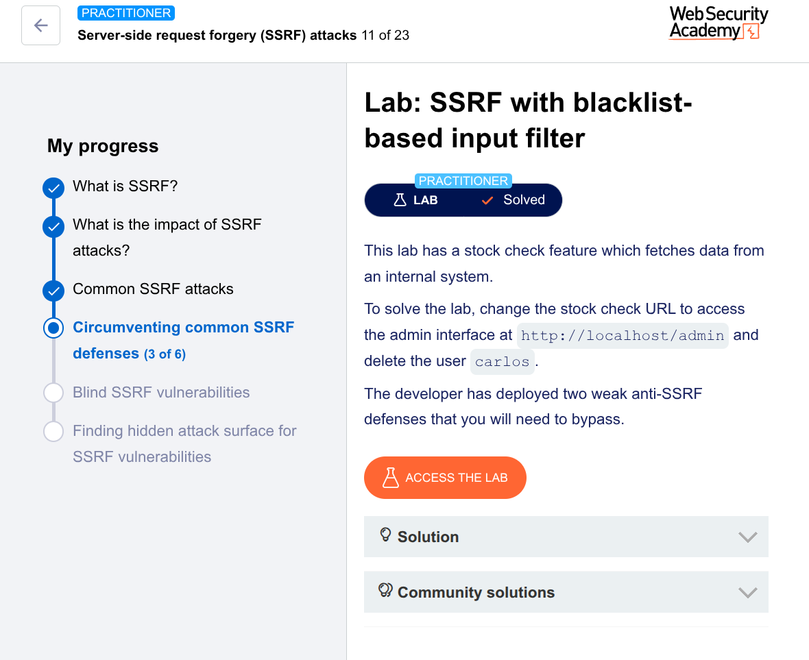

# PortSwigger Lab: SSRF with Blacklist-Based Input Filter

**Lab Link:** *[SSRF with blacklist-based input filter](https://portswigger.net/web-security/ssrf/lab-ssrf-with-blacklist-filter)*  
**Difficulty:** Practitioner  
**Techniques:** SSRF, blacklist bypass, alternative IP representations, double URL encoding

---

## Objective

The lab has a stock check feature that fetches data from an internal system.  
We need to:

1. Access the admin interface at `http://localhost/admin`
2. Delete the user `carlos`

The developer added two weak anti‑SSRF defenses. We’ll bypass them.

---

## Step 1 – Understand the Feature

- Open the lab and view a product.
- Click **“Check stock”**.
- Intercept the request in Burp Suite.

We see a `stockApi` parameter with a URL like:

```
POST /product/stock HTTP/1.1
...
stockApi=http://stock.wlmtarget.net:8080/product/stock/check?productId=1&storeId=1
```

The app fetches this URL and returns the response.

---

## Step 2 – Test for SSRF

Change `stockApi` to:

```
http://127.0.0.1/
```

Send the request.

**Result:** Blocked.  
The developer added a blacklist for `127.0.0.1` and `localhost`.

---

## Step 3 – First Bypass (Alternative IP Representation)

Instead of `127.0.0.1`, use the shortened form `127.1`.

```
http://127.1/
```

**Result:** Works. The request is no longer blocked.

> Why? Many parsers interpret `127.1` as `127.0.0.1`. The blacklist only checked the full `127.0.0.1`.

---

## Step 4 – Access the Admin Interface

Now try to reach `/admin`:

```
http://127.1/admin
```

**Result:** Blocked again.  
The blacklist also blocks the string `/admin`.

---

## Step 5 – Second Bypass (Double URL Encoding)

We need to bypass the `/admin` blacklist without changing the actual path the server sees.

**Technique:** Double URL encode the letter `a` in `admin`.

- Single encode: `a` → `%61` → `admin` becomes `%61dmin`
- Double encode: `%61` → `%2561` → `admin` becomes `%2561dmin`

Why double encoding?  
The filter decodes the URL once, sees `%61dmin`, doesn’t see `/admin`, and lets it pass.  
The server decodes it again, turning `%2561dmin` → `%61dmin` → `admin`.

---

Use this payload:

```
http://127.1/%2561dmin
```

Send the request.

**Result:** The admin page loads.

---

## Step 6 – Delete Carlos

Look for the delete endpoint for `carlos`.  
In the admin page HTML we see:

```
<a href="/admin/delete?username=carlos">Delete</a>
```

We need to request:

```
http://127.1/%2561dmin/delete?username=carlos
```

Send the request.

**Result:** `carlos` is deleted. Lab solved.

---

## Final Payload

```
http://127.1/%2561dmin/delete?username=carlos
```

---

## Why This Worked

| Defense                        | Bypass                                      |
|--------------------------------|---------------------------------------------|
| Blocked `127.0.0.1`            | Used `127.1` (alternative IP representation) |
| Blocked `/admin`               | Used double URL encoding: `%2561dmin`       |
| Blocked literal string checks  | Filter decoded once, server decoded again   |

---

## Key Takeaways

- Blacklists are weak — they miss alternative representations and encodings.
- Double encoding can hide forbidden strings from naive filters.
- Always test shortened IPs like `127.1`, `0`, `127.0.1`.
- If the app follows redirects, you can also use redirect‑based bypasses (not needed here).

---

## Tools Used

- Burp Suite (Repeater, Proxy)
- Browser (to trigger stock check)

---

## References

- [PortSwigger: SSRF](https://portswigger.net/web-security/ssrf)
- [URL encoding bypasses](https://portswigger.net/web-security/ssrf/lab-ssrf-with-blacklist-filter)

---
