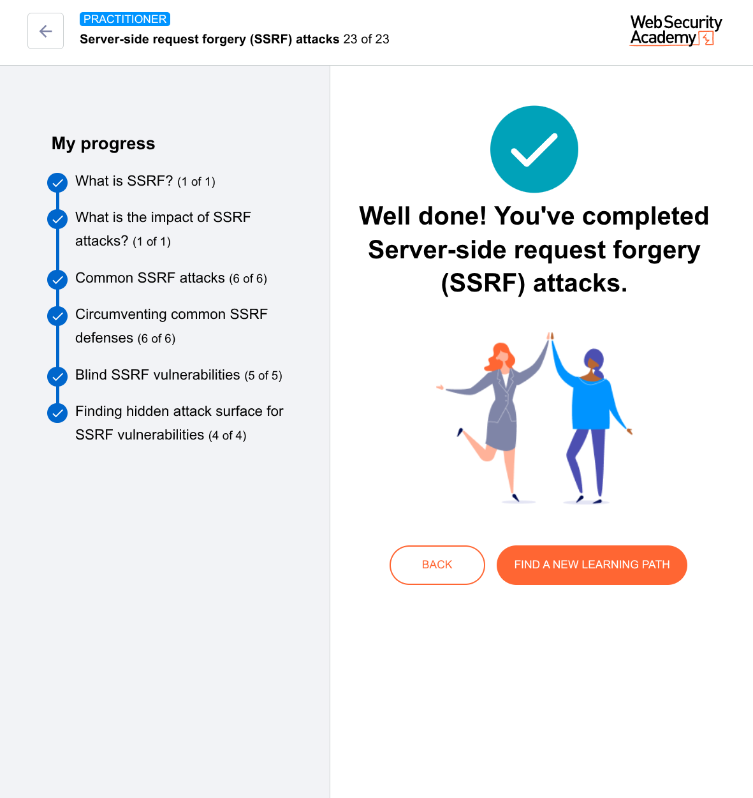

# SSRF via the Referer header


---

## The Big Idea (ONE sentence)

> **The server reads the "Referer" header (which says where you came from) and then VISITS that website itself — giving you control over what the server requests.**

---

## First, what is the Referer header?

When you click a link from **Website A** to **Website B**, your browser automatically tells Website B:

> *"Hey, I just came from Website A."*

That's the Referer header.

### Example:

You're on `google.com` and you click a link to `facebook.com`.

Facebook's server sees:
```
Referer: https://google.com
```

Facebook knows: *"This visitor came from Google."*

---

## Where does SSRF come in?

Many websites run **analytics software** (like Google Analytics, Mixpanel, or custom tools).

This analytics software doesn't just *log* the Referer header.  
It sometimes **visits** the Referer URL to:
- See what the referring page looks like
- Read the anchor text (the clickable words) of the link
- Check if it's a real website or spam

**And that's the vulnerability.**

If the analytics software visits the Referer URL, and you control that URL, you can make the server visit **any address you want** — including internal ones.

---

## A simple story to understand

**You're a security tester.**

1. You find a website: `https://shopping-site.com/products/shoes`

2. Normally, your browser sends no Referer (or sends a normal one).

3. But you can **forge** (fake) the Referer header using a tool like Burp Suite or even just browser dev tools.

4. You change the Referer to: `http://169.254.169.254/latest/meta-data/`

5. The server's analytics software sees: *"Visitor came from http://169.254.169.254/latest/meta-data/"*

6. Analytics software thinks: *"Let me visit that referring site to analyze it."*

7. **The server visits the cloud metadata endpoint.**

8. You've just performed SSRF through the Referer header.

---

## Why is this hidden attack surface?

| Normal SSRF | Referer Header SSRF |
|-------------|----------------------|
| You look for `?url=` parameters | You look for *any* request that logs analytics |
| Obvious and often protected | No one thinks about headers |
| User input is clearly a URL | User input is just a "where I came from" |

The Referer header is **user-controlled data** that almost every website accepts. And many backend analytics tools **automatically fetch** any URL in that header.

---

## Real-world example (simplified)

**Company:** A news website.

**What they have:** An analytics dashboard that shows "Top referring sites" and even takes screenshots of those sites.

**What the developer thought:** *"We'll visit the referring site to capture a preview image. That's helpful for our editors."*

**What an attacker does:**
1. Finds a page on the news site: `https://news.com/article/123`
2. Sends a request with Referer: `http://internal-admin-panel.local/secret`
3. Analytics software visits `http://internal-admin-panel.local/secret` to take a screenshot
4. If that internal panel returns data, the attacker might get it (depending on how the software handles the response)

**Result:** Hidden SSRF from a header that everyone sends automatically.

---

## How to test for Referer SSRF (practical steps)

### You'll need:
- A target website
- A listener (webhook.site or Burp Collaborator)
- A way to modify headers (Burp Suite, or even browser dev tools)

### Step 1: Capture a normal request
Visit any page on the target site. Use Burp Suite or your browser's network tab to see the request.

### Step 2: Change the Referer header
Modify the request so the Referer becomes:
```
Referer: http://YOUR-LISTENER.com/ssrf-test
```
(Replace YOUR-LISTENER.com with your webhook.site URL)

### Step 3: Send the request
Forward the modified request to the server.

### Step 4: Watch your listener
Go to webhook.site. Wait 5-10 seconds.

**Did you see a request arrive from the target server's IP address?**

- **YES** → You found SSRF! The server visited your listener.
- **NO** → Either the site doesn't fetch Referers, or it fetches them asynchronously (try waiting longer, 30-60 seconds).

### Step 5: Escalate (if you got a hit)
Now change your Referer to something internal:
```
Referer: http://169.254.169.254/latest/meta-data/
```
or
```
Referer: http://localhost/admin
```
or
```
Referer: http://10.0.0.1/
```

If the server fetches these and you see the response (in an error message, a screenshot, or a delayed response), you've found a real SSRF vulnerability.

---

## What makes this especially dangerous?

### 1. It's asynchronous
The request to your Referer URL might happen **in the background**, not immediately. So you won't see an error or response. You need your own listener (webhook.site) to detect it.

### 2. It often has high privileges
The analytics software runs on the server with **internal network access** — exactly what you want for SSRF. It can reach cloud metadata, internal APIs, database ports, etc.

### 3. It's almost everywhere
**Most** websites with analytics track the Referer header. And **many** of those analytics tools fetch the referring URL to enrich their data.

---

## The many ways Referer gets used (more attack surface)

| Analytics software behavior | SSRF potential |
|----------------------------|----------------|
| Fetches the Referer URL to take a screenshot | **High** — server visits any URL |
| Checks if Referer is a real website (HTTP request) | **High** — server validates by visiting |
| Extracts meta tags from Referer URL | **Medium** — server visits, but might limit to specific domains |
| Logs Referer but doesn't fetch | **None** — safe |

The dangerous ones are those that **actively fetch** the Referer.

---

## Advanced trick: The "double fetch"

Some analytics software does this:

1. Sees Referer: `http://evil.com`
2. Fetches `http://evil.com`
3. Reads any links on `evil.com`
4. **Then fetches those links too**

That means you can chain SSRF:

```
Referer: http://YOUR-SERVER.com/redirect-chain
```

Your server responds with an HTML page containing:
```html
<a href="http://169.254.169.254/">Click here</a>
```

The analytics software sees that link and visits it — without you ever putting the internal address directly in the Referer header.

---

## Simple detection flowchart

```
1. Send request to target with Referer = your listener
                ↓
2. Wait 30 seconds, check listener
                ↓
   Did listener get a request from target's IP?
                ↓
   YES → SSRF confirmed! (Try internal addresses)
                ↓
   NO → Try different page types (product pages, search results, etc.)
                ↓
   Still NO → Target likely doesn't fetch Referers
```

---

## Real-world example you'd find

**Target:** A job board website `careers.example.com`

**Test:** Send a request to a job listing with Referer = your webhook.site URL

**Listener receives:** A request from `careers.example.com` IP address, 2 seconds later

**Confirmed SSRF!**

**Now test internal:**
```
Referer: http://localhost:8080/admin
Referer: http://169.254.169.254/latest/user-data
Referer: http://internal-database:5432/
```

**If any of these return data** in an error message, log, or screenshot preview → Critical vulnerability.

---

## How developers mistakenly think it's safe

They think:
> *"The Referer header is just a string. We're just storing it in a database. No harm."*

But they forget:  
> **The analytics library they installed** (third-party) **might be fetching that URL** without their knowledge.

Many popular analytics tools and SEO tools automatically "verify" or "analyze" referring URLs by making HTTP requests.

---

## Your mastery checklist

After reading this, you should know:

- [ ] The Referer header is controlled by the user (can be faked)
- [ ] Many analytics tools **visit** the Referer URL
- [ ] You need an external listener (webhook.site) to detect this
- [ ] Even if you see no immediate response, the server might still fetch your URL
- [ ] This works on almost any website that has analytics

---

## Final simple rule

> **Whenever you test any website for SSRF, ALWAYS change the Referer header to your listener URL and see if it gets visited.**

It takes 2 seconds and has found countless hidden SSRF vulnerabilities in the wild.

The Referer header is like a secret backdoor into the server's internal network — because the server itself will happily walk through that door for you.


